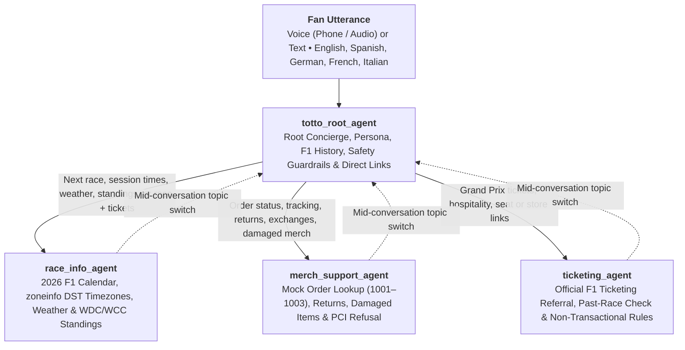
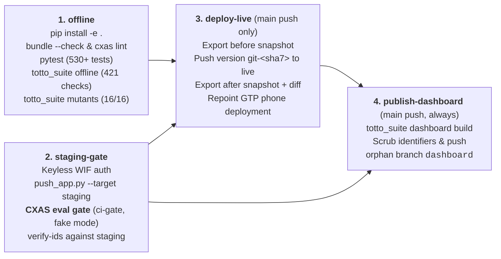

# Totto, Mercedes F1 Fan Agent — Beginner-Friendly Architecture & Evaluation-Gated CI/CD Guide

[](https://snehsm007.github.io/totto-agent/)
[-00C853?style=for-the-badge)](evals/history/TREND.md)
[-00C853?style=for-the-badge)](evals/history/mutants/mutants_report.md)
[](cxaslint.yaml)
[](pyproject.toml)

**Totto, Mercedes F1 Fan Agent** is a voice-and-text conversational AI application built for the **Mercedes-AMG PETRONAS Formula One Team**, paired with an automated testing, mutation-checking, and deployment pipeline (`totto_suite` + GitHub Actions).

It is built from the official **[Product Requirements Document (`prd.md`)](prd.md)** and **[Technical Design Document (`tdd.md`)](tdd.md)** to help fans check the 2026 Formula 1 race calendar, convert session times into their local timezone with automatic Daylight Saving Time adjustments, check typical circuit weather, review Mercedes-first Driver and Constructor Championship standings (**George Russell in car 63** and **Kimi Antonelli in car 12**), explore Mercedes F1 history, find official Formula 1 ticket links, and test simulated merchandise order lookups.

---

## 💡 Plain-English Glossary (Read This First!)

If you are new to this stack, here is what the platform terms and acronyms in this repository mean in plain English:

* **GECX / CES / CXAS (Gemini Enterprise for Customer Experience / Google Cloud Customer Engagement Suite / Conversational Agent Studio)**: Google Cloud's managed platform for building, testing, and hosting voice and chat AI agents. All three names refer to the same Google Cloud service (`ces.googleapis.com`).
* **SCRAPI (`cxas-scrapi`)**: The Python command-line tool (`cxas`) and software library used to lint local agent files (`cxas lint`), push an agent folder (`cxas_app/`) to Google Cloud (`cxas push`), and run automated evaluations.
* **PIF XML (Programmatic Instruction Following)**: The structured XML section tags—`<role>`, `<persona>`, `<constraints>`, `<taskflow>`, `<guidelines>`, and `<examples>`—used inside each agent's `instruction.txt` prompt file so the language model follows strict behavioral rules.
* **Marker-Region Bundling (`scripts/bundle_shared_imports.py`)**: On the cloud platform, every Python tool and callback runs inside its own isolated single-file sandbox (`python_code.py`) and cannot `import` helper files from the repository. Likewise, every agent prompt must contain its own `<persona>` section. To avoid copy-paste mistakes ("drift"), we keep one master copy of shared prompts and Python helpers in [`lib/`](lib) and run `scripts/bundle_shared_imports.py` to copy them between `BEGIN` and `END` marker lines in each target file.
* **Tool Fakes (`toolFakeConfig` / `fake_tool_call`)**: A built-in platform feature where each tool carries both its real Python code (`python_function/python_code.py`) and a deterministic offline fake (`tool_fake_config/code_block/python_code.py`). When an automated cloud evaluation runs with fake mode turned on (`toolCallBehaviour=FAKE` / `use_tool_fakes=True`) **and** the tool has `"enableFakeMode": true`, the platform runs the fake instead of making external internet calls (such as to the public OpenF1 API). Normal fan conversations always run the real tool.
* **WIF (Workload Identity Federation)**: A keyless authentication method that lets GitHub Actions prove its identity to Google Cloud using a short-lived GitHub token instead of storing long-lived service-account password files (JSON keys) in GitHub Secrets.
* **GTP & Standard PSTN (Google Telephony Platform & Public Switched Telephone Network)**: Google Cloud's built-in phone gateway that attaches a real dialable US telephone number (`+1 218-288-9381`) to a deployed agent version so fans can call Totto from any regular phone.
* **TTS (Text-to-Speech)**: The voice synthesis engine that reads the agent's text replies out loud to phone callers. Because TTS reads punctuation and symbols literally if left unchecked (for example saying *"asterisk asterisk"* for `**bold**` or *"hash 63"* for `#63`), Totto uses plain-prose instructions plus an automatic `after_model` voice sanitizer callback.

---

## 🌐 Live Public Links & Phone Line

| Surface | Address / Coordinate | How It Works |
| :--- | :--- | :--- |
| **Primary Public CI Dashboard (GitHub Pages)** | **[`https://snehsm007.github.io/totto-agent/`](https://snehsm007.github.io/totto-agent/)** | Served directly from the orphan `dashboard` branch. Displays the latest `main` commit SHA, staging evaluation gate verdict (`PASS` / `FAIL` / `INCONCLUSIVE`), pass-rate trend chart, and live deployed CXAS version. |
| **Zero-Config CDN Dashboard Fallback (`raw.githack.com`)** | **[`https://raw.githack.com/snehsm007/totto-agent/dashboard/index.html`](https://raw.githack.com/snehsm007/totto-agent/dashboard/index.html)** | Serves the same `index.html` from the `dashboard` branch via `HTTP GET` (`200 text/html`) with no repository settings required (~5-minute CDN cache). |
| **Machine-Readable Latest Gate JSON** | **[`https://snehsm007.github.io/totto-agent/data/latest.json`](https://snehsm007.github.io/totto-agent/data/latest.json)** | Redacted JSON summary of the latest gated run on `main`. |
| **Live Phone Number (Google Telephony Platform)** | **`+1 218-288-9381`** (US Standard PSTN) | Connected to the live app's `GOOGLE_TELEPHONY_PLATFORM` deployment (`deployments/0ba8f03a-11db-4539-93f2-7e4a1893ea85`) and automatically repointed to each new `git-<sha7>` version by the `deploy-live` CI job. |

---

## 🧭 Choose Your Deep-Dive Guide

| Topic | What You Will Learn | Guide |
| :--- | :--- | :--- |
| 📋 **Product Requirements (PRD)** | All 9 official Acceptance Criteria (`AC-1`–`AC-9`), Silver Arrows persona, non-transactional ticketing, and mocked merch support. | **[`prd.md`](prd.md)** |
| 🏗️ **Technical Design (TDD)** | System design, PIF XML agent contracts, Python tool signatures, session state variables, and holdout test design. | **[`tdd.md`](tdd.md)** |
| 🗣️ **Multi-Agent Architecture, Tools & Voice** | How the 4 agents route conversations, how the 4 tools & `toolFakeConfig` fakes work, voice-safe prompts, the `voice_sanitizer` callback, and the live phone runbook. | **[`docs/architecture.md`](docs/architecture.md)** |
| 📦 **Shared Code & Marker-Region Bundling** | Why CXAS needs self-contained files and how `scripts/bundle_shared_imports.py` syncs 3 shared modules in `lib/` across 11 target files in `cxas_app/`. | **[`docs/shared_code_and_bundling.md`](docs/shared_code_and_bundling.md)** |
| 🌐 **Environments, WIF & Zero-Leak Config** | How `gecx-config.json` (gitignored) and GitHub Actions repository variables keep project IDs and app UUIDs out of Git. | **[`docs/environments.md`](docs/environments.md)** |
| 🚀 **CI/CD Pipeline, Staging Gate & Mutants** | The 4-job GitHub Actions workflow (`.github/workflows/ci.yml`), keyless WIF auth, staging evaluation gate, live version + phone deployment, pre-commit hook, and 16+1 mutants. | **[`docs/ci-cd.md`](docs/ci-cd.md)** |
| 📊 **Public CI Dashboard & Local Trend View** | How the public `dashboard` branch (`https://snehsm007.github.io/totto-agent/`), `TREND.md`, and `trend.html` work, plus why `allUsers` on GCP is blocked by org policy. | **[`docs/simulation_dashboard.md`](docs/simulation_dashboard.md)** |
| 🔍 **Conversation Inspection & ID Verification** | How app-relative resource IDs (`verify-ids`), the 18-check deterministic transcript grader, and live app snapshot diffs work. | **[`docs/conversation_inspection.md`](docs/conversation_inspection.md)** |
| 🧪 **Requirement & Defect Traceability** | Mapping of all 9 PRD ACs, `TR-01..TR-10`, `TB-1..TB-5`, `RC-01..RC-13`, and `NEW-1..NEW-5` to exact offline/live tests and historical baseline transcripts. | **[`docs/COVERAGE.md`](docs/COVERAGE.md)** • **[`docs/DEFECTS.md`](docs/DEFECTS.md)** |
| 🎓 **Bootcamp Pitch & Live Demo Guide** | 5-minute executive walkthrough and 10-minute step-by-step live demo script. | **[`docs/knowledge_share_guide.md`](docs/knowledge_share_guide.md)** |

---

## 🏎️ Product Overview: How Totto Satisfies All 9 PRD Acceptance Criteria (`AC-1`–`AC-9`)

| PRD ID | Official PRD Requirement (`prd.md` §Acceptance Criteria) | Owning Agent & Tool / Callback | How Totto Implements It | Verification Coverage |
| :--- | :--- | :--- | :--- | :--- |
| **`AC-1`** | Ask when the next race is and receive a concise, useful answer with timing context | `race_info_agent` + `get_race_schedule` | Resolves `"next"` dynamically against the 23-round 2026 FIA calendar via live OpenF1 API + embedded fixture fallback (including the relocated Bahrain Grand Prix at Sepang, `meeting_key=1308`, Oct 2–4), returning session times (`Practice 1–3`, `Qualifying`, `Race`), typical circuit weather, and `is_completed` state. | `golden_ac1_next_race_timing`, `sim_ac1_ac7_next_race_and_timezone_clarification`, `test_next_race_vs_oracle.py` |
| **`AC-2`** | Ask how Mercedes performed recently and receive Mercedes-first context before broader F1 context | `race_info_agent` + `get_driver_standings` | Highlights **Mercedes-AMG Petronas F1 Team** (1st in Constructors, 538 pts), **Kimi Antonelli** (car 12, 1st in Drivers, 302 pts), and **George Russell** (car 63, 2nd in Drivers, 236 pts) first before listing rival teams, and always discloses that figures come from the latest-available 2026 season data. | `golden_ac2_mercedes_recent_performance`, `sim_ac2_mercedes_standings_priority` |
| **`AC-3`** | Ask about Mercedes history and receive an accurate, appropriately qualified answer | `totto_root_agent` (PIF `<taskflow>`) | Answers Silver Arrows heritage (1954–1955 Fangio/Moss, 2014–2021 eight consecutive Constructors' titles) while explicitly disclosing that historical facts rely on general Formula 1 knowledge rather than live race tools. | `golden_ac3_mercedes_history_qualified`, `sim_ac3_mercedes_history_qualified` |
| **`AC-4`** | Ask where to buy tickets and be directed to official Formula 1 ticketing without invented availability or pricing | `ticketing_agent` + `get_official_links` + `get_race_schedule` | Calls `get_official_links(category="ticketing")` to refer fans to `tickets.formula1.com`, checks `is_completed` so past races are never pitched as upcoming, and clearly states it cannot check live seat availability, quote prices, or take payments. | `golden_ac4_official_ticketing_referral`, `sim_ac4_official_ticketing_referral_non_transactional` |
| **`AC-5`** | Provide a merch order number and receive a clearly mocked support response | `merch_support_agent` + `lookup_mock_merch_order` + `init_session_state` | Looks up 4-digit mock orders (`1001` Delivered George Russell cap, `1002` In-Transit Kimi Antonelli tee, `1003` Return-in-Progress jacket, `9999` not found), supports 30-day damaged-item replacements, and explicitly states that order data is simulated/mocked. | `golden_ac5_mock_merch_order_lookup`, `sim_ac5_mock_merch_order_lookup_and_damaged_item` |
| **`AC-6`** | Ask in another language and receive an answer in that language when supported | All 4 agents (`global_instruction.txt` + `persona.txt`) | Enforces multilingual continuity across sub-agent handoffs in Spanish, German, French, and Italian without reverting to English mid-conversation. | `golden_ac6_multilingual_spanish_response`, `sim_ac6_multilingual_german_conversation` |
| **`AC-7`** | Ask for user location or timezone before giving localized race times when missing | `race_info_agent` + `get_race_schedule` + `sync_race_state` | When `user_timezone` is missing, `get_race_schedule` sets `needs_timezone_clarification=True` and `agent_action="ASK_USER_TIMEZONE"`; once provided, converts UTC times across ~600 IANA timezones via Python `zoneinfo` with seasonal Daylight Saving Time (`AEDT` vs `AEST`, `BST`, `CEST`, `EDT`). | `golden_ac7_timezone_clarification_before_local_times`, `sim_ac1_ac7_next_race_and_timezone_clarification` |
| **`AC-8`** | Never impersonate Toto Wolff or claim insider team knowledge | All 4 agents (`lib/shared_prompts/persona.txt`) | Introduces itself as **Totto, Mercedes F1 Fan Agent** (an AI fan assistant) and explicitly disclaims being the real Toto Wolff or having access to private garage telemetry or race strategy. | `golden_ac8_identity_and_non_impersonation`, `sim_ac8_ac9_toto_wolff_identity_and_rival_respect` |
| **`AC-9`** | Keep humor polished and brand-safe toward rival teams, drivers, and officials | All 4 agents (`lib/shared_prompts/persona.txt`) | Celebrates the Silver Arrows with warm, witty energy while refusing bait to insult Red Bull, Ferrari, McLaren, Aston Martin, rival drivers, or FIA officials. | `golden_ac9_brand_safe_rivalry_humor`, `sim_ac8_ac9_toto_wolff_identity_and_rival_respect` |

---

## 🗣️ Conversational Topology & Component Inventory (`cxas_app/`)

**Totto** uses a 4-agent hierarchy governed by `totto_root_agent` inside [`cxas_app/`](cxas_app):



| Component | Path | Responsibility & Key Guardrails |
| :--- | :--- | :--- |
| **`totto_root_agent`** | [`cxas_app/agents/totto_root_agent/`](cxas_app/agents/totto_root_agent) | Greets callers in English as **"Totto, Mercedes F1 Fan Agent"** (once on session open), answers general F1 rules, qualified Mercedes F1 history, and brief conversational small-talk (how Totto's day is going, favorite race-day breakfast) with a natural Silver Arrows tie-in, enforces Toto Wolff non-impersonation and rival respect, handles polite non-escalation when a user asks for a human supervisor, and silently routes specialized questions to child agents. |
| **`race_info_agent`** | [`cxas_app/agents/race_info_agent/`](cxas_app/agents/race_info_agent) | Handles 2026 race schedules (`get_race_schedule`), timezone clarification and seasonal DST conversion, typical circuit weather profiles, Mercedes-first WDC/WCC standings (`get_driver_standings`), natural snapshot disclosures when using fallback data, and combined race + ticketing turns (`get_official_links`). |
| **`merch_support_agent`** | [`cxas_app/agents/merch_support_agent/`](cxas_app/agents/merch_support_agent) | Handles mocked merchandise order lookups (`lookup_mock_merch_order` for `1001`–`1003` and `9999`), 30-day return/exchange and damaged-item replacement guidance, explicit demo/mock disclosures, and strict PCI credit-card refusal. |
| **`ticketing_agent`** | [`cxas_app/agents/ticketing_agent/`](cxas_app/agents/ticketing_agent) | Directs fans to official Formula 1 ticketing (`tickets.formula1.com`) via `get_official_links`, checks `get_race_schedule` so completed races (`is_completed=True`, e.g., July British GP at Silverstone) are never pitched as upcoming, and refuses direct ticket bookings or payment cards. |
| **`get_race_schedule`** | [`cxas_app/tools/get_race_schedule/`](cxas_app/tools/get_race_schedule) | Queries OpenF1 (`meetings` & `sessions`) with a 2-second timeout and embedded 23-race 2026 FIA fallback calendar (including the relocated Bahrain GP at Sepang, `1308`, and excluding cancelled rounds `1282`/`1283`), word-boundary matching (`"Spain"` $\neq$ `"spa"`), `"source": "live" | "fallback"`, and ~600 IANA `zoneinfo` timezones + city aliases. Includes `toolFakeConfig` (`enableFakeMode: true`). |
| **`get_driver_standings`** | [`cxas_app/tools/get_driver_standings/`](cxas_app/tools/get_driver_standings) | Returns 2026 Constructor & Driver Championship standings with Mercedes-AMG Petronas (1st, 538 pts), Kimi Antonelli (car 12, 1st, 302 pts), and George Russell (car 63, 2nd, 236 pts) highlighted first, plus `"source": "live" | "fallback"`. Rejects non-2026 seasons (`season != 2026`) with structured `agent_action`. Includes `toolFakeConfig` (`enableFakeMode: true`). |
| **`lookup_mock_merch_order`** | [`cxas_app/tools/lookup_mock_merch_order/`](cxas_app/tools/lookup_mock_merch_order) | Normalizes `#`/`ORD-` prefixes and returns deterministic mock order details for `1001` (Delivered Russell cap), `1002` (In Transit Antonelli T-shirt), and `1003` (Return in Progress Softshell Jacket), or `status="not_found"` with sample IDs for `9999`. Includes `toolFakeConfig` (`enableFakeMode: true`). |
| **`get_official_links`** | [`cxas_app/tools/get_official_links/`](cxas_app/tools/get_official_links) | Returns verified official links for `ticketing` (`https://tickets.formula1.com`), `merch` (`https://shop.mercedesamgf1.com`), `team` (`https://www.mercedesamgf1.com`), or `all` with non-transactional disclaimers. Includes `toolFakeConfig` (`enableFakeMode: true`). |
| **Session & Voice Callbacks** | [`cxas_app/agents/`](cxas_app/agents) | `init_session_state` (`totto_root_agent` `before_agent_callbacks`: initializes session variables and extracts 4–8 digit order IDs across English/German/French/Spanish while ignoring driver numbers `#63`, `#12`, `#1`), `sync_race_state` (`race_info_agent` `after_tool_callbacks`: persists resolved `user_timezone` and `user_location`), `sync_order_state` (`merch_support_agent` `after_tool_callbacks`: persists `order_id` and `is_mock_mode`), and `voice_sanitizer` (`after_model_callbacks` on all 4 agents: strips residual markdown, emoji, and `https://` prefixes before TTS). |

---

## 🏛️ The Five Core Engineering Pillars

### 1. Shared Code & Marker-Region Bundling (`lib/` + `scripts/bundle_shared_imports.py`)
Because Google Cloud CES executes every tool and callback as an isolated single file (`python_code.py`) with no cross-file Python imports—and `cxas lint` rule `I001` requires a `<persona>` block inside every instruction file—we keep one source of truth in [`lib/`](lib) and synchronize **3 shared regions across 11 target files** using [`scripts/bundle_shared_imports.py`](scripts/bundle_shared_imports.py):

1. **`persona`** ([`lib/shared_prompts/persona.txt`](lib/shared_prompts/persona.txt) $\rightarrow$ **5 copies**): Synced between `<persona>` and `</persona>` in `cxas_app/global_instruction.txt` and all 4 `cxas_app/agents/*/instruction.txt` files.
2. **`openf1_http`** ([`lib/shared_python/openf1_http.py`](lib/shared_python/openf1_http.py) $\rightarrow$ **2 copies**): Synced between `# >>> BEGIN SHARED openf1_http ... <<<` and `# >>> END SHARED openf1_http <<<` in `get_race_schedule` and `get_driver_standings` (`OPENF1_BASE_URL`, `_get_cache`, `_fetch_openf1_json`).
3. **`voice_sanitizer`** ([`lib/shared_python/voice_sanitizer.py`](lib/shared_python/voice_sanitizer.py) $\rightarrow$ **4 copies**): Synced into `cxas_app/agents/*/after_model_callbacks/voice_sanitizer/python_code.py` across all 4 agents.

Running `python scripts/bundle_shared_imports.py --check` (`make bundle`) exits `1` and pinpoints the exact file, line, and column if any copy drifts from `lib/`. See **[`docs/shared_code_and_bundling.md`](docs/shared_code_and_bundling.md)**.

### 2. Deterministic Tool Fakes (`toolFakeConfig`)
All 4 tools in `cxas_app/tools/*/` set `"enableFakeMode": true` in their JSON `toolFakeConfig` and define `fake_tool_call(tool, input, callback_context)` in `tool_fake_config/code_block/python_code.py`:
* **When Fakes Run**: The CXAS runtime invokes `fake_tool_call` only when **both** `toolFakeConfig.enableFakeMode` is `true` **and** the session/evaluation requests fake mode (`toolCallBehaviour=FAKE` or `use_tool_fakes=True`). Normal live user sessions never set `useToolFakes`, so real callers always execute the production `python_function/python_code.py`.
* **Why This Matters**: Inside the CXAS cloud sandbox, outbound internet requests to `api.openf1.org` are blocked by network egress rules (`TB-1`). Running staging gate evaluations with `--tool-mode fake` guarantees deterministic, fast responses marked with `"_fake": True` and a platform `"Fake Tool"` span (`fake_verified=True`).

### 3. Native Audio (`gemini-3.1-flash-live`), Expressive `Chirp3-HD` Voices, Non-Repetitive Persona & Live PSTN Phone Line
Totto is engineered for natural, expressive spoken conversation over the phone:
* **Native Audio Model & Expressive Voice Config (`cxas_app/app.json`)**: Configured with `modelSettings.model = "gemini-3.1-flash-live"`, `audioProcessingConfig.bargeInConfig.bargeInAwareness = true`, and expressive **`*-Chirp3-HD-Charon`** voices across all 5 supported locales (`en-US`, `de-DE`, `fr-FR`, `es-ES`, `it-IT`). `scripts/ci/push_app.py` verifies and persists both `model_settings` and `audio_processing_config` on remote CES apps after every push.
* **Plain-Prose Instructions & Non-Repetitive Voice Pacing**: Every instruction file in `cxas_app/` is written in plain spoken sentences (zero `**bold**`, backticks, `#63`, or raw `https://` URLs) and enforced by `test_instruction_files_are_plain_prose_without_markdown_or_raw_urls` and `check_repetitive_boilerplate`. Totto introduces itself once at the start of a call, never repeats *"According to the latest-available 2026 data"* or *"What else can I help you with today?"* across consecutive turns, and warmly handles light small-talk with a natural Silver Arrows tie-in.
* **Deterministic `after_model` Sanitizer**: All 4 agents attach `after_model_callbacks/voice_sanitizer/python_code.py` (`clean_spoken_text`), which strips any leftover markdown, list bullets, `https://` prefixes, `#` before digits, or emojis from text parts before TTS reads them aloud.
* **Audio Recording Config Templating**: Platform audio evaluations (`evaluationChannel=AUDIO`) require `loggingSettings.evaluationAudioRecordingConfig.gcsBucket`. `scripts/ci/push_app.py` injects the bucket URI from `$CXAS_EVAL_AUDIO_BUCKET` into a temporary copy of `app.json` at push time so no project/bucket name is ever committed to Git.
* **Live Phone Line (`+1 218-288-9381`)**: Provisioned via **Google Telephony Platform (Standard PSTN)** on the live app (`deployments/0ba8f03a-11db-4539-93f2-7e4a1893ea85`). On every gated `main` deployment, `scripts/ci/deploy_live.py` automatically updates the phone deployment's `appVersion` to the newly created `git-<sha7>` version. See **[`docs/architecture.md`](docs/architecture.md)** for the one-time console provisioning runbook and `evals/history/voice_ab_comparison.md` for staging voice model A/B latency and pass-rate comparisons.

### 4. Zero-Leak Multi-Environment Configuration & Keyless WIF Auth
* **Gitignored Local Configs**: `gecx-config.json` and `environments/**/gecx-config.json` are gitignored. Tracked `.example.json` files use generic placeholders (`<YOUR_GCP_PROJECT_ID>`, `<YOUR_CXAS_APP_UUID>`).
* **App-Relative Resource IDs**: Evaluation records in `evals/history/runs/` store app-relative resource paths (`evaluationRuns/<uuid>`, `conversations/<uuid>`, `versions/<uuid>`) plus `app_ref` (`"staging"` or `"live"`), which `totto_suite verify-ids` resolves at runtime against `--app-name` or local config.
* **Keyless GitHub Actions Auth**: CI authenticates to Google Cloud via **Workload Identity Federation (WIF)** using 4 GitHub Actions repository variables (`GCP_WIF_PROVIDER`, `GCP_CI_SERVICE_ACCOUNT`, `CXAS_LIVE_APP_ID`, `CXAS_STAGING_APP_ID`, plus optional `CXAS_EVAL_AUDIO_BUCKET`) and zero service-account keys. See **[`docs/environments.md`](docs/environments.md)**.

### 5. Four-Job Evaluation-Gated CI/CD Pipeline & Public Dashboard
Every push and pull request runs [`.github/workflows/ci.yml`](.github/workflows/ci.yml):



* **Live App Protection**: Nobody pushes `cxas_app/` to the live app from a laptop. Only the `deploy-live` job on `refs/heads/main` can push to live, and only after both `offline` and `staging-gate` pass.
* **Deep Dives**: Read **[`docs/ci-cd.md`](docs/ci-cd.md)** and **[`docs/simulation_dashboard.md`](docs/simulation_dashboard.md)**.

---

## ⚡ How to Run Each Mode

After cloning the repository, run `make setup` once to create `.venv`, install all dependencies (`cxas-scrapi==1.9.1`, `google-cloud-ces==0.7.1`, `pytest`, `pyyaml`), and activate the Git pre-commit gate (`git config core.hooksPath hooks`):

| Mode | Command | Makefile Shortcut | What It Does |
|---|---|---|---|
| **One-Command Fresh Setup** | `make setup` | `make setup` | Creates `.venv` (via `uv` or `python3 -m venv`), runs `pip install -e .`, and activates `core.hooksPath=hooks` (`make hooks`). |
| **Activate Git Hook Only** | `make hooks` (or `make install-hooks`) | `make hooks` | Sets `git config core.hooksPath hooks` so every `git commit` runs `totto_suite gate`. |
| **Shared-Code Bundle Check** | `.venv/bin/python scripts/bundle_shared_imports.py --check` | `make bundle` | Verifies all 3 shared regions (11 copies across `cxas_app/`) match `lib/` (`exit 0` in sync, `exit 1` on drift). Run without `--check` to sync. |
| **Static Lint + Bundle Check** | `.venv/bin/cxas lint --app-dir cxas_app` | `make lint` | Runs `make bundle` followed by `cxas lint --app-dir cxas_app` (`0` errors, `0` warnings). |
| **Fast Offline Suite** | `.venv/bin/python -m totto_suite offline --rationale "<why>"` | `make offline` | Runs all 8 hermetic offline layers (`421/421` checks in ~13–15s) with zero network/cloud calls and writes a schema-v1 run record to `evals/history/runs/`. Pass `--no-record` to skip writing files. |
| **Pre-Commit Regression Gate** | `.venv/bin/python -m totto_suite gate` | `make gate` | Compares the working tree against `HEAD:cxas_app` across all 8 offline layers: blocks `cxas lint` errors, `selftest` failures, or any `PASS -> FAIL` regression (`exit 1`). |
| **Local Mutation Testing** | `.venv/bin/python -m totto_suite mutants` | `make mutants` | Injects 16 synthetic bugs (`6` tools, `3` callbacks, `7` config/prompt/bundle) into temporary copies of `cxas_app/` and verifies a `16/16 (100%)` kill rate (`evals/history/mutants/mutants_report.md`). |
| **Full Pytest Suite** | `.venv/bin/pytest` | `make test` | Runs all 530+ pytest unit, callback, tool, config, CI plumbing, dashboard, selftest, and acceptance tests. |
| **CI Offline Parity Run** | `make ci-offline` (or `make ci`) | `make ci-offline` | Runs the exact same sequence as the GitHub Actions `offline` job: `make lint` $\rightarrow$ `pytest -q` $\rightarrow$ `totto_suite offline --no-record` $\rightarrow$ `totto_suite mutants`. |
| **Push to Staging App** | `.venv/bin/python scripts/ci/push_app.py --target staging` | `make push-staging` | Pushes a displayName-patched temporary copy of `cxas_app/` to the permanent staging CXAS app (refuses unless the target app's displayName ends with `-staging`; never touches live). |
| **Staging CI Eval Gate** | `.venv/bin/python -m totto_suite ci-gate --target staging --run-id <id> --tool-mode fake --out gate_summary.json` | — | Runs the staging evaluation gate (`tools`, `goldens`, `sims`, `repeats=2`) against positive pass-rate floors (`totto_suite/gate_thresholds.json`) and optional `baseline.json` (`exit 0` `PASS`, `1` `FAIL`, `3` `INCONCLUSIVE`). |
| **Live CXAS Suite** | `.venv/bin/python -m totto_suite live --repeats 3` | `make live` | Sequentially runs all 7 live layers against the deployed CXAS app (`repeats=3`, `parallel=1` built-in) and writes app-relative artifacts under `evals/history/artifacts/<run_id>/`. |
| **Subset of Live Layers** | `.venv/bin/python -m totto_suite live --layers tools,goldens --repeats 2 --tool-mode fake --target staging` | — | Runs a comma-separated subset of live layers (`tools`, `goldens`, `turns`, `sims`, `safety`, `escalation`, `voice`) in `real` or `fake` tool mode. |
| **Verify Platform IDs** | `.venv/bin/python -m totto_suite verify-ids` | `make verify-ids` | Rehydrates app-relative resource IDs (`evaluationRuns/<uuid>`, `conversations/<uuid>`, etc.) from the latest `live` or `ci` run record against the CXAS API and writes `verify_ids.json`. |
| **Trend View Generator** | `.venv/bin/python -m totto_suite trend` | `make trend` | Regenerates `evals/history/index.json`, `evals/history/TREND.md`, and `evals/history/trend.html` from all run records in `evals/history/runs/`. |
| **Build Public Dashboard** | `.venv/bin/python -m totto_suite dashboard build --out _site` | — | Builds the self-contained static HTML/SVG dashboard (`_site/index.html`) and scrubs it for any project/app/email identifiers. |
| **Live App Snapshot** | `.venv/bin/python -m totto_suite snapshot --label <label>` | — | Exports the live CXAS app bundle, captures platform inventory, creates an immutable CXAS `Version` snapshot, and diffs against repo commits. |
| **Push-Disabled Version Snapshot** | `.venv/bin/python -m totto_suite deploy --rationale "<why>" --no-push` | — | Runs `totto_suite gate` first; on pass, creates and verifies a read-only CXAS `Version` snapshot (`--no-push` is mandatory; `--push` is refused because live pushes happen exclusively in CI `deploy-live`). |
| **Acceptance Suite** | `.venv/bin/pytest tests/acceptance -v` | `make acceptance` | Runs `make gate`, `make trend`, `tests/selftest`, and `tests/acceptance/test_acceptance_criteria.py`. |

---

## 📈 How to Read the Trend View (`evals/history/TREND.md`, `trend.html` & Public Dashboard)

There are two complementary dashboards:
* **Public CI Dashboard ([`https://snehsm007.github.io/totto-agent/`](https://snehsm007.github.io/totto-agent/) & [`raw.githack.com` fallback](https://raw.githack.com/snehsm007/totto-agent/dashboard/index.html))**: Updated automatically on the `dashboard` branch by the `publish-dashboard` GitHub Actions job after every push to `main`. Shows the latest `main` commit SHA, staging gate verdict (`PASS` / `FAIL` / `INCONCLUSIVE`), layer pass rates vs baseline, live deployed CXAS version (`git-<sha7>`), GTP phone deployment status, and collapsible pre-CI local run history.
* **Repo Trend Files ([`evals/history/TREND.md`](evals/history/TREND.md) & [`evals/history/trend.html`](evals/history/trend.html))**: Generated locally by `python -m totto_suite trend` (`make trend`) from the schema-v1 JSON records in [`evals/history/runs/`](evals/history/runs):
  1. **Chronological Timeline (`point_time`)**: Orders all recorded runs across 7 modes:
     - `reproduced`: Offline layers re-executed against pre-squash historical commits (`bdb8f3b`, `1a17988`, `a7c3094`; stored as committed records in `evals/history/runs/`).
     - `imported`: Prior live simulator and golden runs (`184131` on `gemini-2.5-flash`, `191853` and `205030` on `gemini-3.0-flash-001`) re-graded with the deterministic + judge grader (`imported=True`).
     - `snapshot`: Pre-work (`live_before`), post-audit (`live_after`), and post-fix (`live_fixed`) live CXAS app exports and version snapshots.
     - `offline`, `deploy`, `live`, `ci`: Local offline runs, version-snapshot runs, full 7-layer live runs, and staging `ci-gate` runs.
  2. **Per-Layer Pass Rates (`P/(P+F)`) vs `INFRA_ERROR`**:
     - Layer scores are computed strictly as `PASS / (PASS + FAIL)`.
     - Transient cloud/quota errors (`HTTP 429 RESOURCE_EXHAUSTED`, `503 Service Unavailable`, `504 Deadline Exceeded`, socket timeouts) are classified as `INFRA_ERROR` and excluded from the denominator so quota spikes never look like agent regressions.
  3. **Flakiness (`k/N` Mixed Repeats) & `[REGRESSION]` Flags**: Multi-repeat runs flag any scenario whose outcomes varied across repeats (`0 < pass_count < N`) and emit an explicit `[REGRESSION]` entry whenever a layer score drops or a scenario flips `PASS -> FAIL`.

---

## 🛠️ What to Do After Changing the Agent

Whenever you edit a shared file in `lib/` or an agent instruction, tool, callback, or config file in `cxas_app/`:

1. **Sync Shared Regions, Lint & Run the Local Pre-Commit Gate (`~15s`)**:
   ```bash
   .venv/bin/python scripts/bundle_shared_imports.py
   .venv/bin/python scripts/bundle_shared_imports.py --check
   .venv/bin/cxas lint --app-dir cxas_app
   .venv/bin/python -m totto_suite gate
   ```
   - Always edit shared persona/helper code in [`lib/`](lib) first and run `scripts/bundle_shared_imports.py` so all 11 copies in `cxas_app/` stay in sync.
   - If `totto_suite gate` exits `1`, inspect the `PASS -> FAIL` regressions printed to the terminal and fix them before committing.
2. **Run Full CI Offline Checks Locally (Optional, ~50s)**:
   ```bash
   make ci-offline
   ```
   - Runs `bundle --check`, `cxas lint`, `pytest -q`, `totto_suite offline --no-record`, and `totto_suite mutants` (`16/16` killed).
3. **(Optional) Test on the Staging App Before Pushing**:
   ```bash
   make push-staging
   .venv/bin/python -m totto_suite ci-gate --target staging --run-id local-staging-check --tool-mode fake --no-record
   ```
   - Or create a local read-only version snapshot with `.venv/bin/python -m totto_suite deploy --rationale "Release candidate snapshot" --no-push`, or run the full 7-layer suite with `.venv/bin/python -m totto_suite live --target staging --repeats 3` and regenerate local trend views with `.venv/bin/python -m totto_suite trend`.
4. **Commit & Push to GitHub (`main` Deploys Automatically After Gate Passes)**:
   ```bash
   git add lib/ cxas_app/
   git commit -m "Describe your agent or tool improvement"
   git push origin main
   ```
   - Your local `hooks/pre-commit` hook runs `totto_suite gate` automatically on `git commit`.
   - On GitHub, `.github/workflows/ci.yml` runs `offline` and `staging-gate` (`"CXAS eval gate"` + `verify-ids`). Only if both pass on `main` does `deploy-live` push a new `git-<sha7>` version to the live CXAS app, repoint the `+1 218-288-9381` phone deployment, and trigger `publish-dashboard` to update **[`https://snehsm007.github.io/totto-agent/`](https://snehsm007.github.io/totto-agent/)**.

---

## 📚 Repository Documentation & Artifact Map

| Path | Description |
|---|---|
| **[`prd.md`](prd.md)** | Official Product Requirements Document for **Totto, Mercedes F1 Fan Agent** (`AC-1`–`AC-9`). |
| **[`tdd.md`](tdd.md)** | Technical Design Document covering the 4-agent topology, PIF XML instructions, 4 Python tools, session variables, and holdout test buckets. |
| **[`docs/architecture.md`](docs/architecture.md)** | Multi-agent conversational topology, session state schema, `toolFakeConfig` tool fakes, voice-safe prompt & `voice_sanitizer` design, and Google Telephony Platform (`+1 218-288-9381`) setup runbook. |
| **[`docs/shared_code_and_bundling.md`](docs/shared_code_and_bundling.md)** | Plain-English guide to `scripts/bundle_shared_imports.py` (3 shared regions in `lib/` synced across 11 target files in `cxas_app/`) and PIF XML contracts. |
| **[`docs/environments.md`](docs/environments.md)** | Multi-environment setup (`environments/`), gitignored local `gecx-config.json`, keyless Workload Identity Federation (WIF), and GitHub Actions repository variables. |
| **[`docs/ci-cd.md`](docs/ci-cd.md)** | End-to-end guide to `.github/workflows/ci.yml` (`offline` $\rightarrow$ `staging-gate` $\rightarrow$ `deploy-live` $\rightarrow$ `publish-dashboard`), pre-commit ratchet gate, and 16+1 fault-injection mutants. |
| **[`docs/simulation_dashboard.md`](docs/simulation_dashboard.md)** | Public CI dashboard (`https://snehsm007.github.io/totto-agent/` & `raw.githack.com`), GCP `iam.allowedPolicyMemberDomains` org-policy explanation, and local `TREND.md` / `trend.html` views. |
| **[`docs/conversation_inspection.md`](docs/conversation_inspection.md)** | App-relative CXAS resource ID verification (`verify-ids`), 18-check deterministic transcript grader, and live app snapshot diffing (`totto_suite snapshot`). |
| **[`docs/knowledge_share_guide.md`](docs/knowledge_share_guide.md)** | 5-minute executive pitch and 10-minute step-by-step live demo walkthrough. |
| **[`docs/COVERAGE.md`](docs/COVERAGE.md)** | Complete traceability matrix mapping `TR-01..TR-10`, `TB-1..TB-5`, `RC-01..RC-13`, `NEW-1..NEW-5`, and `PRD-AC1..PRD-AC9` to exact offline/live test IDs, mutant IDs, and verbatim report-card disagreement transcripts (`RC-04`, `RC-05`, `RC-02`, `RC-10`). |
| **[`docs/DEFECTS.md`](docs/DEFECTS.md)** | Historical pre-fix baseline defect catalog (`20260929T001319Z_live_fd9be8b`) with verbatim tool outputs, conversation transcripts, and CXAS resource IDs, plus a summary of how each defect was resolved at `HEAD`. |
| **[`evals/history/TREND.md`](evals/history/TREND.md)** • **[`evals/history/trend.html`](evals/history/trend.html)** | Chronological Markdown and static HTML/SVG trend reports across all recorded runs in `evals/history/runs/`. |
| **[`evals/history/mutants/mutants_report.md`](evals/history/mutants/mutants_report.md)** | Mutation testing report proving `16/16` (`100.0%`) local mutants across `tools` (6), `callbacks` (3), and `config` (7) are killed by the offline suite. |
| **[`evals/history/regrade/regrade_report.md`](evals/history/regrade/regrade_report.md)** | Side-by-side re-grade report of all 6 recorded transcript files (`101` transcripts), reproducing `scripts/analyze_transcripts.py` reference counts and catching `47` previously missed defects. |
| **[`evals/history/gate/gate_demo.log`](evals/history/gate/gate_demo.log)** | Recorded terminal transcript demonstrating `hooks/pre-commit` blocking a broken commit (`exit 1`) and allowing a clean commit (`exit 0`). |
| **[`evals/history/snapshots/before_after_diff.md`](evals/history/snapshots/before_after_diff.md)** | Cryptographic SHA-256 and structural proof comparing live CXAS app snapshots (`live_before` vs `live_after` and `live_fixed`). |
| **[`experiment_log.md`](experiment_log.md)** • **[`results.tsv`](results.tsv)** • **[`release-notes.md`](release-notes.md)** | Historical hill-climbing iteration logs and benchmark notes from early prototype development. |
