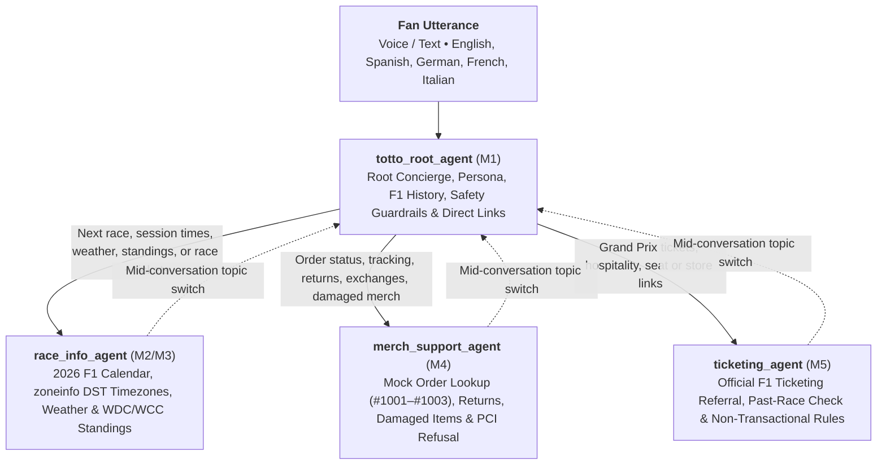
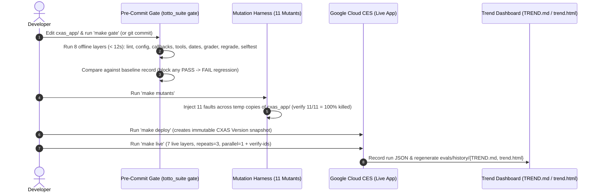

# Totto, Mercedes F1 Fan Agent — Enterprise Conversational AI Architecture & DevOps Blueprint

[-00C853?style=for-the-badge)](evals/history/TREND.md)
[-00C853?style=for-the-badge)](evals/history/TREND.md)
[-00C853?style=for-the-badge)](evals/history/mutants/mutants_report.md)
[](cxaslint.yaml)
[](pyproject.toml)

**Totto, Mercedes F1 Fan Agent** is an enterprise reference architecture, production conversational AI application, and DevOps blueprint built on the **Google Cloud Customer Engagement Suite (CES) / GECX / CXAS** platform from the official **[Product Requirements Document (`prd.md`)](prd.md)** and **[Technical Design Document (`tdd.md`)](tdd.md)**.

It models a voice-first, multilingual frontline fan concierge for the **Mercedes-AMG PETRONAS Formula One Team**—celebrating **George Russell (`#63`)** and **Kimi Antonelli (`#12`)** while helping fans check 2026 FIA Formula 1 race schedules, convert session start times into local timezones with seasonal Daylight Saving Time (`zoneinfo`), inspect circuit weather, review Mercedes-first WDC/WCC championship standings, explore qualified Formula 1 history, navigate to official Formula 1 ticketing portals, and test simulated merchandise order & returns support.

Beyond the conversational agent itself (`cxas_app/`), this repository establishes production-grade engineering patterns for:
* **Hierarchical Multi-Agent Topology (`cxas_app/agents/`)**: 4 specialized conversational agents (`totto_root_agent`, `race_info_agent`, `merch_support_agent`, `ticketing_agent`) authored with Programmatic Instruction Following (PIF) XML contracts, silent sub-agent handoffs, and session-state callbacks.
* **Shared Code & DRY Prompt Architecture (`lib/`)**: Maintaining canonical brand persona, voice/TTS formatting rules, and safety guardrails once in `lib/shared_prompts/persona.txt` and synchronizing them across all agents via `scripts/bundle_shared_imports.py`.
* **Clean Tool Controllers & Offline Mock Tool Fakes (`cxas_app/tools/`)**: 4 serverless Python tools (`get_race_schedule`, `get_driver_standings`, `lookup_mock_merch_order`, `get_official_links`) integrating live OpenF1 REST data with embedded 2026 FIA season snapshots and native `toolFakeConfig` (`fake_tool_call`) for deterministic sandbox testing.
* **Multi-Environment Sandboxing (`environments/`)**: Decoupled local configuration (`gecx-config.json`, gitignored by default) separating GCP deployment coordinates from source code with zero secret or project-ID leakage in Git.
* **Continuous Evaluation, Mutation Testing & Version-Linked Gating (`evals/`, `totto_suite/`)**: An 8-layer hermetic offline suite (`< 12s`), 7-layer live CXAS evaluation runner (`repeats=3`), 11-mutant fault-injection harness (`100%` kill rate), 17-check deterministic transcript grader, pre-commit regression gate, and commit-to-CXAS-version trend dashboard.

---

## 🧭 Choose Your Architectural Focus

Explore the dedicated deep-dive documentation for each engineering pillar:

| Engineering Pillar | Key Capabilities & Highlights | Dedicated Guide |
| :--- | :--- | :--- |
| 📋 **Product Requirements (PRD)** | Official 9 Acceptance Criteria (`AC-1`–`AC-9`), voice-first UX, Silver Arrows persona, non-transactional ticketing, and mock merch scope. | **[`prd.md`](prd.md)** |
| 🏗️ **Technical Design (TDD)** | End-to-end system design, PIF XML agent contracts, Python tool signatures, session state variables, and 4-bucket holdout matrix. | **[`tdd.md`](tdd.md)** |
| 🗣️ **Multi-Agent Topology & Tools** | Hierarchical 4-agent routing (`totto_root_agent` $\rightarrow$ 3 specialists), session state callbacks, and `toolFakeConfig` mock tool fakes. | **[`docs/architecture.md`](docs/architecture.md)** |
| 📦 **Shared Code & DRY Bundling** | Centralized prompt policy (`lib/shared_prompts/persona.txt`), tag-matched XML synchronization, and single-file cloud tool packaging. | **[`docs/shared_code_and_bundling.md`](docs/shared_code_and_bundling.md)** |
| 🌐 **Multi-Environment Ops** | Gitignored local deployment configs (`gecx-config.json`), environment templates (`environments/`), and WIF/ADC secret decoupling. | **[`docs/environments.md`](docs/environments.md)** |
| 🚀 **CI/CD, Pre-Commit Gate & Mutants** | Pre-commit ratchet gate (`hooks/pre-commit`), 11-mutant fault injection (`totto_suite mutants`), and CXAS version snapshot pipeline. | **[`docs/ci-cd.md`](docs/ci-cd.md)** |
| 📊 **Simulation & Trend Dashboard** | Chronological commit-to-CXAS-version scoring (`evals/history/TREND.md` & `trend.html`), quota-safe `P/(P+F)` math, and `[REGRESSION]` flags. | **[`docs/simulation_dashboard.md`](docs/simulation_dashboard.md)** |
| 🔍 **Conversation Inspection & Grading** | Live CXAS resource ID verification (`verify-ids`), 17-check deterministic transcript re-grader, and cryptographic live app snapshot diffing. | **[`docs/conversation_inspection.md`](docs/conversation_inspection.md)** |
| 🧪 **Requirement & Defect Traceability** | Complete mapping of all 9 PRD ACs, 10 test-report findings, 5 tool bugs, and 13 report-card items to exact offline & live tests. | **[`docs/COVERAGE.md`](docs/COVERAGE.md)** • **[`docs/DEFECTS.md`](docs/DEFECTS.md)** |
| 🛠️ **Dev Experience & Parity** | Standardized local-to-CI execution contract (`Makefile` + `totto_suite`) running 313 offline checks in `< 12s`. | **[`Makefile`](Makefile)** |
| 🎓 **Knowledge Share & Demo Guide** | 5-minute executive pitch and 10-minute step-by-step live demo walkthrough. | **[`docs/knowledge_share_guide.md`](docs/knowledge_share_guide.md)** |

---

## 🏎️ Product Overview: The Main Totto Agent Built from the PRD

**Totto** (`cxas_app/`) is designed from the ground up to satisfy every functional, persona, and brand-safety requirement in **[`prd.md`](prd.md)**:

### 1. Fulfillment of All 9 Official PRD Acceptance Criteria (`AC-1`–`AC-9`)

| PRD ID | Official PRD Requirement (`prd.md` §Acceptance Criteria) | Owning Agent & Tool / Callback | How Totto Implements It | Verification Coverage |
| :--- | :--- | :--- | :--- | :--- |
| **`AC-1`** | Ask when the next race is and receive a concise, useful answer with timing context | `race_info_agent` + `get_race_schedule` | Resolves `"next"` dynamically against the 23-round 2026 FIA calendar via live OpenF1 API + embedded fixture fallback, returning session times (`FP1`–`FP3`, `Sprint`, `Qualifying`, `Race`), circuit weather, and `is_completed` state. | `golden_ac1_next_race_timing`, `sim_ac1_ac7_next_race_and_timezone_clarification`, `test_next_race_vs_oracle.py` |
| **`AC-2`** | Ask how Mercedes performed recently and receive Mercedes-first context before broader F1 context | `race_info_agent` + `get_driver_standings` | Prioritizes **Mercedes-AMG PETRONAS F1 Team** (`P1` Constructors), **George Russell (`#63`)**, and **Kimi Antonelli (`#12`)** in `mercedes_summary` and `mercedes_drivers` before listing the wider field. | `golden_ac2_mercedes_recent_performance`, `sim_ac2_mercedes_standings_priority` |
| **`AC-3`** | Ask about Mercedes history and receive an accurate, appropriately qualified answer | `totto_root_agent` (PIF `<taskflow>`) | Answers Silver Arrows heritage (1954–1955 Fangio/Moss, 2014–2021 8x Constructors' titles) while explicitly disclosing that historical facts rely on general F1 knowledge rather than live race telemetry. | `golden_ac3_mercedes_history_qualified`, `sim_ac3_mercedes_history_qualified` |
| **`AC-4`** | Ask where to buy tickets and be directed to official Formula 1 ticketing without invented availability or pricing | `ticketing_agent` + `get_official_links` + `get_race_schedule` | Calls `get_official_links(category="ticketing")` to refer fans to `https://tickets.formula1.com`, checks `is_completed` for past races, and refuses to invent seat availability, prices, or booking authority. | `golden_ac4_official_ticketing_referral`, `sim_ac4_official_ticketing_referral_non_transactional` |
| **`AC-5`** | Provide a merch order number and receive a clearly mocked support response | `merch_support_agent` + `lookup_mock_merch_order` + `init_session_state` | Looks up 4-digit mock orders (`#1001` Delivered cap, `#1002` In-Transit tee, `#1003` Return-in-Progress jacket, `#9999` not found), supports 30-day damaged-item replacements, and explicitly discloses that order data is simulated/mocked. | `golden_ac5_mock_merch_order_lookup`, `sim_ac5_mock_merch_order_lookup_and_damaged_item` |
| **`AC-6`** | Ask in another language and receive an answer in that language when supported | All 4 agents (`global_instruction.txt`) | Enforces strict multilingual continuity across sub-agent handoffs in Spanish, German, French, and Italian without reverting to English mid-conversation. | `golden_ac6_multilingual_spanish_response`, `sim_ac6_multilingual_german_conversation` |
| **`AC-7`** | Ask for user location or timezone before giving localized race times when missing | `race_info_agent` + `get_race_schedule` + `sync_race_state` | When `user_timezone` is empty, `get_race_schedule` sets `needs_timezone_clarification=True` and `agent_action="ASK_USER_TIMEZONE"`; once provided, converts UTC times across ~600 IANA zones via `zoneinfo` with seasonal DST (`AEDT` vs `AEST`, `BST`, `EDT`, etc.). | `golden_ac7_timezone_clarification_before_local_times`, `sim_ac1_ac7_next_race_and_timezone_clarification` |
| **`AC-8`** | Never impersonate Toto Wolff or claim insider team knowledge | `totto_root_agent` (`lib/shared_prompts/persona.txt`) | Introduces itself as **Totto, Mercedes F1 Fan Agent** (an AI fan concierge) and explicitly disclaims being the real Toto Wolff or having access to private garage telemetry or race strategy. | `golden_ac8_identity_and_non_impersonation`, `sim_ac8_ac9_toto_wolff_identity_and_rival_respect` |
| **`AC-9`** | Keep humor polished and brand-safe toward rival teams, drivers, and officials | All 4 agents (`lib/shared_prompts/persona.txt`) | Celebrates the Silver Arrows with witty, fan-friendly energy while refusing adversarial bait to insult Red Bull, Ferrari, McLaren, rival drivers, or FIA officials. | `golden_ac9_brand_safe_rivalry_humor`, `sim_ac8_ac9_toto_wolff_identity_and_rival_respect` |

---

## 🗣️ Conversational Topology & Domain Capabilities

**Totto** uses a hierarchical 4-agent topology governed by `totto_root_agent` inside [`cxas_app/`](cxas_app):



### Agent, Tool & Callback Inventory (`cxas_app/`)

| Component | Path | Responsibility & Key Guardrails |
| :--- | :--- | :--- |
| **`totto_root_agent`** | [`cxas_app/agents/totto_root_agent/`](cxas_app/agents/totto_root_agent) | Greets callers as **"Totto, Mercedes F1 Fan Agent"**, answers general F1 rules and qualified Mercedes F1 history, enforces Toto Wolff non-impersonation and rival respect, handles polite non-escalation for supervisor requests (calls `get_official_links` without dropping the session), and silently routes specialized intents to child agents. |
| **`race_info_agent`** | [`cxas_app/agents/race_info_agent/`](cxas_app/agents/race_info_agent) | Handles 2026 race schedules (`get_race_schedule`), timezone clarification and seasonal DST conversion, circuit weather profiles, Mercedes-first WDC/WCC standings (`get_driver_standings`), and combined race + ticketing turns (`get_official_links`). |
| **`merch_support_agent`** | [`cxas_app/agents/merch_support_agent/`](cxas_app/agents/merch_support_agent) | Handles mocked merchandise order lookups (`lookup_mock_merch_order` for `#1001`–`#1003` and `#9999`), 30-day return/exchange and damaged-item replacement guidance, explicit demo/mock disclosures, and strict PCI credit-card refusal. |
| **`ticketing_agent`** | [`cxas_app/agents/ticketing_agent/`](cxas_app/agents/ticketing_agent) | Directs fans to official Formula 1 ticketing (`https://tickets.formula1.com`) via `get_official_links`, checks `get_race_schedule` so completed races (`is_completed=True`, e.g., July British GP at Silverstone) are never pitched as upcoming, and refuses direct ticket bookings or payment cards. |
| **`get_race_schedule`** | [`cxas_app/tools/get_race_schedule/`](cxas_app/tools/get_race_schedule) | Queries OpenF1 (`meetings` & `sessions`) with a 2s timeout and embedded 23-race 2026 FIA fallback calendar (including `1308` Kuala Lumpur Oct 2–4 and excluding cancelled rounds `1282`/`1283`), word-boundary matching (`"Spain"` $\neq$ `"spa"`), and ~600 IANA `zoneinfo` timezones + city aliases. Includes `tool_fake_config`. |
| **`get_driver_standings`** | [`cxas_app/tools/get_driver_standings/`](cxas_app/tools/get_driver_standings) | Returns 2026 Constructor & Driver Championship standings with Mercedes-AMG PETRONAS (`P1`), George Russell (`#63`), and Kimi Antonelli (`#12`) highlighted first. Rejects non-2026 seasons (`season != 2026`) with structured `agent_action`. Includes `tool_fake_config`. |
| **`lookup_mock_merch_order`** | [`cxas_app/tools/lookup_mock_merch_order/`](cxas_app/tools/lookup_mock_merch_order) | Normalizes `#`/`ORD-` prefixes and returns deterministic mock order details for `1001` (Delivered cap), `1002` (In Transit tee), and `1003` (Return in progress jacket), or `status="not_found"` with sample IDs for `9999`. Includes `tool_fake_config`. |
| **`get_official_links`** | [`cxas_app/tools/get_official_links/`](cxas_app/tools/get_official_links) | Returns verified HTTPS URLs for `ticketing` (`https://tickets.formula1.com`), `merch` (`https://shop.mercedesamgf1.com`), `team` (`https://www.mercedesamgf1.com`), or `all` with non-transactional disclaimers. Includes `tool_fake_config`. |
| **Session Callbacks (3)** | [`cxas_app/agents/`](cxas_app/agents) | `init_session_state` (extracts 4–8 digit order IDs across English/German/French/Spanish while ignoring driver numbers `#63`, `#12`, `#1`), `sync_race_state` (persists resolved `user_timezone` and `user_location`), and `sync_merch_state` (persists `order_id`). |

---

## 🏛️ The Core Engineering Pillars

### 1. Shared Code Architecture, Reusable Prompt Modules & DRY Bundling
Google Cloud CES executes each Python tool, tool fake, and callback inside an isolated serverless sandbox that deploys a single script file (`python_code.py`). Simultaneously, maintaining identical Silver Arrows brand voice, TTS plain-text rules (zero emojis or raw Markdown in spoken replies), and safety guardrails across 4 agent `instruction.txt` files requires automated prompt synchronization.

```
┌──────────────────────────────────────────────────────────┐
│  Shared Prompt Library & Tool Contracts (lib/ & scripts/)│
│  ├── lib/shared_prompts/persona.txt (canonical <persona>)│
│  └── scripts/bundle_shared_imports.py                    │
└─────────────────────────────┬────────────────────────────┘
                              │ make bundle / make lint
              ┌───────────────┴───────────────┐
              ▼                               ▼
┌───────────────────────────────┐ ┌───────────────────────────────┐
│ Self-Contained Serverless     │ │ Synchronized Sub-Agent        │
│ Python Tools (cxas_app/tools/)│ │ Prompts (cxas_app/agents/)    │
│ • Production python_function  │ │ • Tag-matched <persona> sync  │
│ • Offline tool_fake_config    │ │ • PIF XML & I001–I016 checked │
└───────────────────────────────┘ └───────────────────────────────┘
```

* **Zero Prompt Drift**: Shared persona and brand-safety directives live in [`lib/shared_prompts/persona.txt`](lib/shared_prompts/persona.txt) and are verified across all 4 agents via `python scripts/bundle_shared_imports.py --check`.
* **Dual-Mode Serverless Tools (`python_function` + `toolFakeConfig`)**: Every tool in `cxas_app/tools/<tool>/` includes both its production handler and a deterministic `tool_fake_config/code_block/python_code.py` (`fake_tool_call`) so cloud evaluations and offline sandboxes never fail on external network restrictions.
* **Deep Dive**: Read **[`docs/shared_code_and_bundling.md`](docs/shared_code_and_bundling.md)**.

---

### 2. Multi-Environment Hierarchy & Zero-Leak Configuration
To keep GCP project IDs, application UUIDs, and developer sandbox coordinates completely decoupled from tracked source code:

```
environments/
├── dev-totto-gecx/
│   ├── gecx-config.example.json  # Tracked template (generic placeholders)
│   └── gecx-config.json          # Local active config (GITIGNORED)
├── staging-totto-gecx/
│   └── gecx-config.example.json  # Tracked staging template
└── local-<user>-totto-gecx/      # Personal developer sandbox (GITIGNORED)
    └── gecx-config.json
```

* **Zero Project or Config Details in Git**: Both root `gecx-config.json` and `environments/**/gecx-config.json` are gitignored. Tracked `.example.json` templates document the schema using generic placeholders (`<YOUR_GCP_PROJECT_ID>`, `<YOUR_CXAS_APP_UUID>`).
* **Automatic Local Discovery**: `totto_suite/config.py` and `Makefile` automatically read `gecx-config.json` from the local workspace (or `TOTTO_APP_NAME` / `GCP_PROJECT_ID` environment variables) when running live cloud operations, while all 8 offline layers run hermetically with zero cloud configuration required.
* **Deep Dive**: Read **[`docs/environments.md`](docs/environments.md)**.

---

### 3. Continuous Evaluation, Pre-Commit Gate, Mutation Testing & Trend Dashboard
Unit tests alone cannot guarantee that an LLM agent won't leak raw Python tool calls, drop a caller during a supervisor request, or hallucinate race dates. This blueprint pairs the Totto agent with **`totto_suite`**—a multi-layer offline and live verification pipeline:



* **8 Hermetic Offline Layers (`313/313 PASS` in `< 12s`)**: `lint` (`cxas lint`), `config` (PIF XML & contract checks), `callbacks` (state extraction across 4 languages), `tools` (unit + contract + `toolFakeConfig` parity), `dates` (runtime date oracle across 5 frozen 2026 dates), `grader` (17 deterministic checks), `regrade` (101 historical transcripts), and `selftest`.
* **11-Mutant Fault Injection (`11/11 = 100%` Killed)**: `totto_suite mutants` clones `cxas_app/` into temporary directories, injects 11 realistic bugs across tools, callbacks, and agent configs, and proves the offline suite catches every single one ([`evals/history/mutants/mutants_report.md`](evals/history/mutants/mutants_report.md)).
* **17-Check Deterministic Transcript Grader**: Hard-gates LLM judge results so any conversation with a spoken code leak, dead-air handoff, ungrounded race/order fact, or dropped escalation is automatically marked `FAIL`.
* **Deep Dives**: Read **[`docs/ci-cd.md`](docs/ci-cd.md)**, **[`docs/simulation_dashboard.md`](docs/simulation_dashboard.md)**, and **[`docs/conversation_inspection.md`](docs/conversation_inspection.md)**.

---

## ⚡ How to Run Each Mode

Run all commands from the repository root using the `.venv` Python environment (or the equivalent `Makefile` shortcuts):

| Mode | Command | Makefile Shortcut | What It Does |
|---|---|---|---|
| **Fast Offline Suite** | `.venv/bin/python -m totto_suite offline --rationale "<why>"` | `make offline` | Runs all 8 offline layers (`313/313` checks) in `< 12s` with zero network/LLM calls and writes a schema-v1 run record to `evals/history/runs/`. |
| **Single Offline Layer** | `.venv/bin/python -m totto_suite offline --layer tools --no-record` | — | Runs one offline layer (`lint`, `tools`, `dates`, `callbacks`, `config`, `grader`, `regrade`, `selftest`). |
| **Pre-Commit Gate** | `.venv/bin/python -m totto_suite gate` | `make gate` | Compares the working tree against the baseline run record: blocks `cxas lint` errors, `selftest` failures, or any `PASS -> FAIL` regression (`exit 1`). |
| **Install Git Hook** | `make install-hooks` | `make install-hooks` | Configures Git `core.hooksPath` to `hooks/` so `git commit` automatically runs `totto_suite gate` when `cxas_app/` or `totto_suite/` is staged. |
| **Live CXAS Suite** | `.venv/bin/python -m totto_suite live --repeats 3 --parallel 1` | `make live` | Runs all 7 live layers against the deployed CXAS app (`repeats=3`, `parallel=1`), verifies every returned platform resource ID via CXAS API, and writes artifacts under `evals/history/artifacts/<run_id>/`. |
| **Single Live Layer** | `.venv/bin/python -m totto_suite live --layer live_tools --repeats 3 --parallel 1` | — | Runs a single live layer (`live_tools`, `live_goldens`, `live_turns`, `live_sims`, `live_safety`, `live_escalation`, `live_voice`). |
| **Mutation Testing** | `.venv/bin/python -m totto_suite mutants` | `make mutants` | Applies 11 fault-injection mutants (`tools`, `callbacks`, `config`) to isolated temporary copies of `cxas_app/` and verifies a `100%` kill rate (`evals/history/mutants/mutants_report.md`). |
| **Trend View** | `.venv/bin/python -m totto_suite trend` | `make trend` | Regenerates `evals/history/index.json`, `evals/history/TREND.md`, and `evals/history/trend.html` from all run records in `evals/history/runs/`. |
| **Live App Snapshot** | `.venv/bin/python -m totto_suite snapshot --label <label>` | — | Exports the live CXAS app bundle, captures platform inventory (`versions`, `evaluations`, `conversations`), creates an immutable CXAS `Version` snapshot, and diffs against repo commits. |
| **Safe Deploy Wrapper** | `.venv/bin/python -m totto_suite deploy --rationale "<why>" --no-push` | `make deploy RATIONALE="<why>"` | Runs the offline gate first; on pass, creates and verifies an immutable CXAS `Version` snapshot (`--no-push` by default) and regenerates the trend view. |
| **Acceptance Suite** | `.venv/bin/pytest tests/acceptance -v` | `make acceptance` | Runs end-to-end programmatic verification of all agent and suite acceptance criteria (`326/326` total pytest tests). |

---

## 📈 How to Read the Trend View (`evals/history/TREND.md` & `evals/history/trend.html`)

Open [`evals/history/TREND.md`](evals/history/TREND.md) in any Markdown viewer or [`evals/history/trend.html`](evals/history/trend.html) in a browser:

1. **Chronological Timeline (`point_time`)**: Every historical and current evaluation run is ordered by `point_time` across 6 modes:
   - `reproduced`: Offline layers re-executed against historical git commits (`bdb8f3b`, `1a17988`, `a7c3094`) inside isolated temporary worktrees.
   - `imported`: Prior live simulator and golden runs (`184131` on `gemini-2.5-flash`, `191853` and `205030` on `gemini-3.0-flash-001`) re-graded with the deterministic + judge grader and clearly badged `imported=True`.
   - `snapshot`: Pre-work (`live_before`), post-audit (`live_after`), and post-fix (`live_fixed`) live CXAS app exports and version snapshots.
   - `offline`, `deploy`, `live`: Current offline baseline runs, gated version-snapshot runs, and the 7-layer live CXAS run.
2. **Metadata Columns**: Every row records the exact `agent.commit` (`+dirty` if applicable), `cxas.version_id` (`in_version_list` or `hidden_fetchable`), `cxas.model` (`gemini-2.5-flash` vs `gemini-3.0-flash-001`), and the one-line `rationale`.
3. **Per-Layer Pass Rates (`P/(P+F)`) vs `INFRA_ERROR`**:
   - Layer scores are computed strictly as `PASS / (PASS + FAIL)`.
   - Platform/infrastructure faults (`HTTP 429 RESOURCE_EXHAUSTED`, `503 Service Unavailable`, `504 Deadline Exceeded`, socket timeouts, auth errors) are classified as `INFRA_ERROR` and reported in a dedicated column so quota spikes never masquerade as agent regressions.
4. **Flakiness (`k/N` Mixed Repeats)**: Multi-repeat runs (`repeats >= 3`) report any scenario whose outcomes varied across repeats (`0 < pass_count < N`).
5. **Automatic `[REGRESSION]` Flags**: Whenever a layer's pass rate drops relative to the previous comparable run, a scenario flips `PASS -> FAIL`, or a previously passing scenario becomes flaky, the trend generator emits an explicit `[REGRESSION]` entry with the exact delta and scenario ID.

---

## 🛠️ What to Do After Changing the Agent

Whenever you edit an instruction, shared prompt module, tool, callback, or config file in `cxas_app/` or `lib/`:

1. **Verify Shared Prompt Sync, Lint & Run the Pre-Commit Gate (`< 12s`)**:
   ```bash
   .venv/bin/python scripts/bundle_shared_imports.py --check
   .venv/bin/cxas lint --app-dir cxas_app
   .venv/bin/python -m totto_suite gate
   ```
   - If `totto_suite gate` exits `1`, inspect the `PASS -> FAIL` regressions printed to the terminal and fix them before committing.
   - If you fixed one of the historical agent/tool defects documented in `docs/DEFECTS.md`, the corresponding test will flip `FAIL -> PASS`.
2. **Record an Offline Run & Update the Trend View**:
   ```bash
   .venv/bin/python -m totto_suite offline --rationale "Brief description of your agent/tool change"
   .venv/bin/python -m totto_suite trend
   ```
3. **Create a Gated Version Snapshot (`--no-push`)**:
   ```bash
   .venv/bin/python -m totto_suite deploy --rationale "Release candidate description" --no-push
   ```
4. **Run the Live CXAS Suite & Inspect `TREND.md`**:
   ```bash
   .venv/bin/python -m totto_suite live --repeats 3 --parallel 1 --rationale "Post-change live verification"
   .venv/bin/python -m totto_suite trend
   ```
   Open `evals/history/TREND.md` (or `evals/history/trend.html`) and verify that no new `[REGRESSION]` flags appeared and `INFRA_ERROR` is `0`.

---

## 📚 Repository Documentation & Artifact Map

| Path | Description |
|---|---|
| **[`prd.md`](prd.md)** | Official 226-line Product Requirements Document for **Totto, Mercedes F1 Fan Agent** (`AC-1`–`AC-9`). |
| **[`tdd.md`](tdd.md)** | Technical Design Document covering the 4-agent topology, PIF XML instructions, 4 Python tools, session variables, and 4-bucket holdout suite. |
| **[`docs/architecture.md`](docs/architecture.md)** | 4-agent conversational topology (`totto_root_agent`, `race_info_agent`, `merch_support_agent`, `ticketing_agent`), session state schema, and `toolFakeConfig` architecture. |
| **[`docs/shared_code_and_bundling.md`](docs/shared_code_and_bundling.md)** | Shared prompt synchronization (`lib/shared_prompts/persona.txt`), PIF XML contracts, and single-file serverless tool rules. |
| **[`docs/environments.md`](docs/environments.md)** | Multi-environment setup (`environments/`), gitignored local `gecx-config.json`, and WIF/ADC secret decoupling. |
| **[`docs/ci-cd.md`](docs/ci-cd.md)** | Pre-commit regression gate (`hooks/pre-commit`), 11-mutant fault injection (`totto_suite mutants`), and CXAS version snapshot pipeline. |
| **[`docs/simulation_dashboard.md`](docs/simulation_dashboard.md)** | Chronological trend dashboard (`evals/history/TREND.md` & `evals/history/trend.html`), quota-safe `P/(P+F)` scoring, and `[REGRESSION]` detection. |
| **[`docs/conversation_inspection.md`](docs/conversation_inspection.md)** | Live CXAS resource ID verification (`verify-ids`), 17-check deterministic transcript re-grader, and live app snapshot diffing. |
| **[`docs/knowledge_share_guide.md`](docs/knowledge_share_guide.md)** | 5-minute executive pitch and 10-minute step-by-step live demo script. |
| **[`docs/COVERAGE.md`](docs/COVERAGE.md)** | Full mapping table of `TR-01..TR-10`, `TB-1..TB-5`, `RC-01..RC-13`, `NEW-1..NEW-5`, and `PRD-AC1..PRD-AC9` to exact offline/live test IDs, mutant IDs, and verbatim transcripts explaining where the suite disagrees with the Agent Report Card (`RC-04`, `RC-05`, `RC-02`, `RC-10`). |
| **[`docs/DEFECTS.md`](docs/DEFECTS.md)** | Historical defect catalog and post-fix resolution log with verbatim tool outputs, conversation transcripts, and fetchable CXAS resource IDs. |
| **[`evals/history/TREND.md`](evals/history/TREND.md)** | Chronological Markdown trend report across all historical (`reproduced`, `imported`) and current (`snapshot`, `offline`, `deploy`, `live`) runs with automatic `[REGRESSION]` detection. |
| **[`evals/history/trend.html`](evals/history/trend.html)** | Static self-contained HTML trend dashboard. |
| **[`evals/history/mutants/mutants_report.md`](evals/history/mutants/mutants_report.md)** | Mutation testing report proving `11/11` (`100.0%`) local mutants across `tools`, `callbacks`, and `config` are killed by the offline suite. |
| **[`evals/history/regrade/regrade_report.md`](evals/history/regrade/regrade_report.md)** | Side-by-side re-grade report of all 6 recorded transcript files (`101` transcripts), reproducing `analyze_transcripts.py` reference counts and surfacing `47` previously missed defects. |
| **[`evals/history/gate/gate_demo.log`](evals/history/gate/gate_demo.log)** | End-to-end log demonstrating `hooks/pre-commit` blocking a regressed commit (`exit 1`) and allowing a clean commit (`exit 0`). |
| **[`evals/history/snapshots/before_after_diff.md`](evals/history/snapshots/before_after_diff.md)** | Cryptographic SHA-256 and structural proof comparing live CXAS app snapshots (`live_before` vs `live_after` and `live_fixed`). |
| **[`experiment_log.md`](experiment_log.md)** • **[`results.tsv`](results.tsv)** | Chronological hill-climbing iteration log and tab-separated benchmark history. |
| **[`release-notes.md`](release-notes.md)** | Executive summary and score progression across hill-climbing iterations. |
