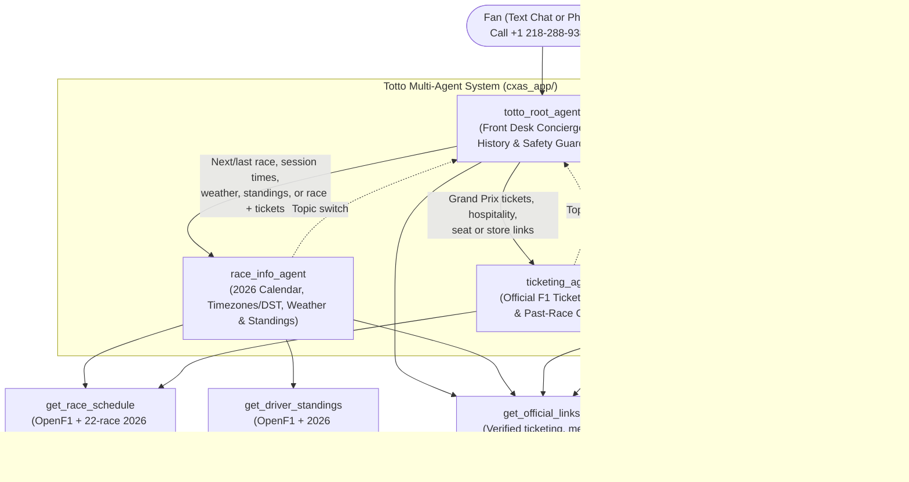

# Architecture & System Design (`docs/architecture.md`)

This guide explains how **Totto, Mercedes F1 Fan Agent** works from top to bottom in plain, beginner-friendly English. No prior experience with Google Cloud Customer Engagement Suite / Conversational Agent Studio (**CXAS** — the cloud platform that hosts the bot) is required.

---

## 1. Quick Glossary of Key Terms

- **Agent**: An AI assistant with a specific job description (stored in an `instruction.txt` prompt file) and a specific list of tools it is allowed to call (configured in `<agent>.json`).
- **Root Agent (`totto_root_agent`)**: The "front desk concierge" of the system. Every fan message or phone call lands here first. It greets the caller, answers general Formula 1 and Mercedes F1 heritage questions, enforces safety guardrails, and silently routes specialized questions to one of three specialist child agents.
- **Child Agent (Specialist Sub-Agent)**: A focused agent that handles one domain (`race_info_agent` for schedules/weather/timezones/standings, `merch_support_agent` for mocked order lookups and returns, or `ticketing_agent` for official Formula 1 ticket referrals) and transfers control back to `totto_root_agent` if the fan changes the subject.
- **Tool**: A Python function inside [`cxas_app/tools/`](../cxas_app/tools) that an agent calls to fetch structured data (for example, querying the 2026 Formula 1 calendar, Championship standings, mocked merchandise orders, or verified official URLs).
- **Tool Fake (`toolFakeConfig`)**: A deterministic, offline test function (`fake_tool_call` inside `tool_fake_config/code_block/python_code.py`) attached to each tool. When an automated cloud evaluation runs with fake mode turned on (`toolCallBehaviour=FAKE` or `use_tool_fakes=True`) **and** the tool JSON sets `"enableFakeMode": true`, the platform executes `fake_tool_call` instead of calling external internet APIs. Normal live user conversations never enable fake mode and always run the real tool.
- **Callback**: A small Python hook that runs automatically at a specific stage of a conversation turn:
  - **`before_agent_callbacks`**: Runs before `totto_root_agent` processes a turn (`init_session_state`), initializing default session state variables and extracting 4–8 digit order numbers from the user's message.
  - **`after_tool_callbacks`**: Runs right after a tool returns data (`sync_race_state` on `race_info_agent`, `sync_order_state` on `merch_support_agent`), saving resolved timezone, location, or order ID fields into session memory (`callback_context.state`) so they persist across agent handoffs.
  - **`after_model_callbacks`**: Runs right after the AI model generates a reply (`voice_sanitizer` on all 4 agents), stripping any residual markdown symbols, emojis, or `https://` prefixes before a Text-to-Speech (TTS) engine reads the reply aloud.
- **Programmatic Instruction Following (PIF XML)**: The structured XML tag layout (`<role>`, `<persona>`, `<constraints>`, `<taskflow>`, `<examples>`, plus `<guidelines>` in `global_instruction.txt`) used inside our prompt files so the language model follows strict rules instead of guessing.
- **Google Telephony Platform (GTP / Standard PSTN)**: Google Cloud's built-in telephone carrier integration that connects a real dialable US phone number (`+1 218-288-9381`) directly to the live deployed agent for voice calls.

---

## 2. Multi-Agent Hierarchy & Routing Topology

Instead of cramming every domain rule and every tool into a single monolithic prompt—which causes language models to confuse rules or call the wrong tool—Totto uses a **4-agent hierarchy** inside [`cxas_app/agents/`](../cxas_app/agents):

### How the 4 Agents Divide Responsibility

| Agent Name | Role & Key Guardrails | Assigned Tools (`<agent>.json`) | Assigned Callbacks | Source Directory |
| :--- | :--- | :--- | :--- | :--- |
| **`totto_root_agent`** | Greets callers once in English as **"Totto, Mercedes F1 Fan Agent"**, answers general F1 rules, qualified Mercedes F1 history (`AC-3`), and brief conversational small-talk (how Totto's day is going, favorite race-day breakfast) with a natural Silver Arrows tie-in, enforces Toto Wolff non-impersonation (`AC-8`) and rival respect (`AC-9`), handles polite non-escalation when a caller asks for a human supervisor, and silently routes domain questions to its 3 child agents (`race_info_agent`, `merch_support_agent`, `ticketing_agent`). | [`get_official_links`](../cxas_app/tools/get_official_links), `end_session` | `before_agent_callbacks`: [`init_session_state`](../cxas_app/agents/totto_root_agent/before_agent_callbacks/init_session_state/python_code.py) `after_model_callbacks`: [`voice_sanitizer`](../cxas_app/agents/totto_root_agent/after_model_callbacks/voice_sanitizer/python_code.py) | [`cxas_app/agents/totto_root_agent/`](../cxas_app/agents/totto_root_agent) |
| **`race_info_agent`** | Answers 2026 F1 race calendar questions (`AC-1`), asks for user timezone/location when missing and converts UTC session times across ~600 IANA timezones with seasonal DST (`AC-7`), provides circuit weather profiles, and reports Mercedes-first Constructor/Driver standings with natural snapshot disclosures (`AC-2`). Also handles compound race + ticket questions in one turn. | [`get_race_schedule`](../cxas_app/tools/get_race_schedule), [`get_driver_standings`](../cxas_app/tools/get_driver_standings), [`get_official_links`](../cxas_app/tools/get_official_links), `end_session` | `after_tool_callbacks`: [`sync_race_state`](../cxas_app/agents/race_info_agent/after_tool_callbacks/sync_race_state/python_code.py) `after_model_callbacks`: [`voice_sanitizer`](../cxas_app/agents/race_info_agent/after_model_callbacks/voice_sanitizer/python_code.py) | [`cxas_app/agents/race_info_agent/`](../cxas_app/agents/race_info_agent) |
| **`merch_support_agent`** | Looks up simulated merchandise orders (`1001`–`1003` and `9999`) via `lookup_mock_merch_order` (`AC-5`), explains 30-day return/exchange and damaged-item replacement workflows, explicitly discloses that order data is mocked/simulated, refuses PCI credit card numbers, and provides the official store link (`shop.mercedesamgf1.com`). | [`lookup_mock_merch_order`](../cxas_app/tools/lookup_mock_merch_order), [`get_official_links`](../cxas_app/tools/get_official_links), [`get_race_schedule`](../cxas_app/tools/get_race_schedule), `end_session` | `after_tool_callbacks`: [`sync_order_state`](../cxas_app/agents/merch_support_agent/after_tool_callbacks/sync_order_state/python_code.py) `after_model_callbacks`: [`voice_sanitizer`](../cxas_app/agents/merch_support_agent/after_model_callbacks/voice_sanitizer/python_code.py) | [`cxas_app/agents/merch_support_agent/`](../cxas_app/agents/merch_support_agent) |
| **`ticketing_agent`** | Directs fans to official Formula 1 ticketing (`tickets.formula1.com`) via `get_official_links` (`AC-4`), checks `get_race_schedule` so completed races (`is_completed=True`) are never pitched as upcoming events, and clearly states it cannot check live seat availability, quote ticket prices, or process payments. | [`get_official_links`](../cxas_app/tools/get_official_links), [`get_race_schedule`](../cxas_app/tools/get_race_schedule), `end_session` | `after_model_callbacks`: [`voice_sanitizer`](../cxas_app/agents/ticketing_agent/after_model_callbacks/voice_sanitizer/python_code.py) | [`cxas_app/agents/ticketing_agent/`](../cxas_app/agents/ticketing_agent) |

### Silent Transfers & Cross-Domain Topic Switching
In CXAS, once `totto_root_agent` transfers a conversation to a child agent (such as `race_info_agent`), that child agent remains active on the next user turn.
- **No "Dead-Air" Handoff Narration (`TR-03`)**: Agents are strictly forbidden from outputting a visible holding message (such as *"Please hold while I transfer you torace_info_agent"*) before calling `transfer_to_agent`. The transfer happens silently so the specialist answers in the very same turn.
- **Mid-Conversation Topic Switches**: Each specialist also carries `get_official_links` (and `merch_support_agent` / `ticketing_agent` carry `get_race_schedule`) to handle common compound follow-ups directly, or silently transfers back to `totto_root_agent` if the fan switches to a different domain (including conversational small-talk).

---

## 3. Tool Contracts, Fallbacks & Dual-Mode Fakes (`toolFakeConfig`)

All 4 tools live under [`cxas_app/tools/`](../cxas_app/tools). Each tool folder contains three files:
1. `<tool_name>.json`: Tool metadata, `pythonFunction` pointer, and `"toolFakeConfig": {"enableFakeMode": true, "codeBlock": {"pythonCode": "tools/<tool_name>/tool_fake_config/code_block/python_code.py"}}`.
2. `python_function/python_code.py`: The production Python function executed during live user conversations and `--tool-mode real` evaluations.
3. `tool_fake_config/code_block/python_code.py`: The deterministic fake implementation (`fake_tool_call`) executed when CXAS runs evaluations with `toolCallBehaviour=FAKE` (`--tool-mode fake`).

### 3.1 `get_race_schedule` ([`cxas_app/tools/get_race_schedule/`](../cxas_app/tools/get_race_schedule))
- **Entrypoint**: `get_race_schedule(race_name: Optional[str] = None, user_timezone: Optional[str] = None, include_weather: bool = False) -> Dict[str, Any]`
- **How it Works**:
  1. Queries the live OpenF1 API (`meetings` and `sessions` via the shared `_fetch_openf1_json` helper) and falls back cleanly to an embedded **22-round 2026 FIA calendar** (`FALLBACK_2026_CALENDAR`, filtering out mislabeled OpenF1 placeholder `meeting_key=1308` Bahrain GP at Sepang/Kuala Lumpur and cancelled rounds `1282` Bahrain and `1283` Saudi Arabia) whenever the CXAS cloud sandbox blocks external internet egress (`TB-1` / `TB-2`). Also stamps `"source": "live"` vs `"fallback"` so `check_disclosure_freshness` knows whether the tool returned live API data or embedded snapshot data.
  2. Uses word-boundary regex matching (`_race_matches_query`) so `"Spain"` never collides with `"spa"` (Circuit de Spa-Francorchamps, Belgium), and returns `status="not_found"` with `agent_action="DO_NOT_INVENT_SCHEDULE"` for unknown races like `"Moon GP"` instead of silently falling back to Round 1 Australia (`TB-3`).
  3. Marks past races with `is_completed=True` and `race_status="completed"` (`TB-5`), and labels future race weather with `is_forecast=False` and `weather_type="typical_historical_circuit_climate_not_live_forecast"` (`TB-4`).
  4. Converts UTC session start times across **~600 IANA timezones** (`zoneinfo.ZoneInfo`) plus an extensive city/country/abbreviation alias table (`_CITY_OR_ABBR_TO_IANA`), handling seasonal Daylight Saving Time transitions automatically (`TR-10`). When `user_timezone` is omitted, sets `needs_timezone_clarification=True` and `agent_action="ASK_USER_TIMEZONE"` (`AC-7`).

### 3.2 `get_driver_standings` ([`cxas_app/tools/get_driver_standings/`](../cxas_app/tools/get_driver_standings))
- **Entrypoint**: `get_driver_standings(category: str = "drivers", season: int = 2026) -> Dict[str, Any]`
- **How it Works**:
  - Normalizes `category` so `"drivers"`, `"constructors"` (or `"teams"`), and `"both"` / `"all"` / `"wdc_and_wcc"` all succeed (`TR-08`).
  - Rejects non-2026 seasons (`season != 2026`) with `status="unsupported_season"` and `agent_action="DISCLOSE_2026_ONLY_TOOL_DATA"` (`TR-09`).
  - Returns the verified **2026 Championship Standings** with a Mercedes-first summary (`mercedes_summary`), `"source": "live" | "fallback"`, and explicit `data_freshness_note`:
    - **Constructors' Championship**: **Mercedes-AMG Petronas F1 Team** is **`position=1`** with **`538` points**, **`11` wins**, and **`20` podiums** (ahead of Ferrari with `430` pts and McLaren with `408` pts).
    - **Drivers' Championship**: **Kimi Antonelli** (car `12`, Mercedes-AMG Petronas) is **`position=1`** with **`302` points** (`8` wins, `11` podiums); **George Russell** (car `63`, Mercedes-AMG Petronas) is **`position=2`** with **`236` points** (`3` wins, `9` podiums).

### 3.3 `lookup_mock_merch_order` ([`cxas_app/tools/lookup_mock_merch_order/`](../cxas_app/tools/lookup_mock_merch_order))
- **Entrypoint**: `lookup_mock_merch_order(order_id: str) -> Dict[str, Any]`
- **Deterministic Catalog (`_MOCK_ORDERS`)**:
  - Strips `#` and `ORD-` prefixes so `"#1001"`, `"ORD-1001"`, and `"1001"` all resolve identically:
  - **`1001`**: `status="Delivered"` — **Mercedes-AMG Petronas George Russell #63 Driver Cap (Black)**, delivered `2026-09-18` via DHL Express (`DHL-DE-88492011`), `eligible_for_return=True` within 30 days.
  - **`1002`**: `status="In Transit"` — **Mercedes-AMG Petronas Kimi Antonelli #12 Team Polo Shirt (Size L)**, estimated delivery `2026-10-02` via UPS Standard (`1Z999AA10123456784`).
  - **`1003`**: `status="Return in Progress"` — **Mercedes-AMG Petronas 2026 Team Softshell Jacket (Size M)**, return received (`DHL-RET-55120934`), refund processing within 3–5 business days.
  - **Unknown ID (e.g., `9999`)**: Returns `status="not_found"`, `known_sample_order_ids=["1001", "1002", "1003"]`, and `official_merch_store_url="https://shop.mercedesamgf1.com"`.
  - Every response sets `is_mock_data=True`, `mock_notice`, and `official_merch_store_url="https://shop.mercedesamgf1.com"` (`AC-5`, `RC-01`).

### 3.4 `get_official_links` ([`cxas_app/tools/get_official_links/`](../cxas_app/tools/get_official_links))
- **Entrypoint**: `get_official_links(category: str = "all") -> Dict[str, Any]`
- Returns verified official URLs and spoken-friendly domain names for:
  - `ticketing`: `https://tickets.formula1.com` (Official Formula 1 Tickets Portal, non-transactional disclaimer)
  - `merch` (or `store` / `shop`): `https://shop.mercedesamgf1.com` (Official Mercedes-AMG PETRONAS F1 Team Store)
  - `team`: `https://www.mercedesamgf1.com` (Official Mercedes-AMG PETRONAS F1 Team Website)
  - `all`: Returns all three links together.

### 3.5 How Dual-Mode `toolFakeConfig` Works
Every tool's `<tool_name>.json` sets `"toolFakeConfig": {"enableFakeMode": true}` and points to [`tool_fake_config/code_block/python_code.py`](../cxas_app/tools/get_race_schedule/tool_fake_config/code_block/python_code.py), which defines `fake_tool_call(tool: Tool, input: dict[str, Any], callback_context: CallbackContext) -> Optional[dict[str, Any]]`.
- **When Fake Mode Runs**: CXAS only invokes `fake_tool_call` when **both** `enableFakeMode: true` is configured on the tool **and** the evaluation request sets `toolCallBehaviour=FAKE` (or `use_tool_fakes=True` in the SDK). Each fake response includes `"_fake": True`, and CXAS records a `"Fake Tool"` span in the turn's execution trace (`fake_verified=True`).
- **When Real Mode Runs**: Normal fan conversations and `--tool-mode real` evaluations omit `useToolFakes`, so CXAS executes `python_function/python_code.py`.

---

## 4. Callbacks & Session State Synchronization

To preserve context across multi-turn conversations and sub-agent handoffs, Totto uses three callback types:

### 4.1 `before_agent_callbacks` (`init_session_state` on `totto_root_agent`)
- Defined in [`cxas_app/agents/totto_root_agent/before_agent_callbacks/init_session_state/python_code.py`](../cxas_app/agents/totto_root_agent/before_agent_callbacks/init_session_state/python_code.py).
- Initializes `is_mock_mode=True`, `user_timezone=""`, `user_location=""`, and `order_id=""` in `callback_context.state`.
- Uses `ORDER_ID_PATTERN` to extract 4–8 digit order IDs from multilingual phrases (`order`, `commande`, `pedido`, `bestellung`, `bestellnummer`, or `#1001`) while ignoring 1–2 digit driver car numbers like `#63` or `#12` (`TR-07`).

### 4.2 `after_tool_callbacks` (`sync_race_state` & `sync_order_state`)
1. **`race_info_agent` $\rightarrow$ [`sync_race_state`](../cxas_app/agents/race_info_agent/after_tool_callbacks/sync_race_state/python_code.py)**:
   - After `get_race_schedule` returns a resolved timezone (`resolved_timezone`), saves `user_timezone` and `user_location` into `callback_context.state` so subsequent race queries remember the caller's city/timezone automatically.
2. **`merch_support_agent` $\rightarrow$ [`sync_order_state`](../cxas_app/agents/merch_support_agent/after_tool_callbacks/sync_order_state/python_code.py)**:
   - After `lookup_mock_merch_order` runs, persists the normalized `order_id` and `is_mock_mode=True` into `callback_context.state`.

### 4.3 `after_model_callbacks` (`voice_sanitizer` on All 4 Agents)
- Synchronized from [`lib/shared_python/voice_sanitizer.py`](../lib/shared_python/voice_sanitizer.py) into all 4 agents' `after_model_callbacks/voice_sanitizer/python_code.py`:
  - [`cxas_app/agents/totto_root_agent/after_model_callbacks/voice_sanitizer/python_code.py`](../cxas_app/agents/totto_root_agent/after_model_callbacks/voice_sanitizer/python_code.py)
  - [`cxas_app/agents/race_info_agent/after_model_callbacks/voice_sanitizer/python_code.py`](../cxas_app/agents/race_info_agent/after_model_callbacks/voice_sanitizer/python_code.py)
  - [`cxas_app/agents/merch_support_agent/after_model_callbacks/voice_sanitizer/python_code.py`](../cxas_app/agents/merch_support_agent/after_model_callbacks/voice_sanitizer/python_code.py)
  - [`cxas_app/agents/ticketing_agent/after_model_callbacks/voice_sanitizer/python_code.py`](../cxas_app/agents/ticketing_agent/after_model_callbacks/voice_sanitizer/python_code.py)
- Runs `clean_spoken_text` on every model response part, stripping markdown bold/italic (`**`, `*`), headings (`#`), list bullets, inline code backticks, `[label](https://...)` link syntax, `https://` prefixes, `#` before digits (`#63` $\rightarrow$ `63`), and emojis before TTS synthesis.

---

## 5. Voice & Telephony Architecture (`+1 218-288-9381`)

Because Totto serves callers on a **live telephone line (`+1 218-288-9381`)** as well as web chat, its model, voice configuration, prompts, and runtime are engineered specifically for natural spoken audio:

### 5.1 Native Audio Model (`gemini-3.1-flash-live`) & Expressive `audioProcessingConfig`
In [`cxas_app/app.json`](../cxas_app/app.json):
- **`modelSettings`**: Uses **`gemini-3.1-flash-live`** (`temperature: 0.3`) for low-latency, expressive voice-first conversation.
- **`audioProcessingConfig`**: Configures `bargeInConfig.bargeInAwareness = true` (so Totto adapts smoothly if a caller interrupts mid-sentence) and maps all 5 supported locales (`en-US`, `de-DE`, `fr-FR`, `es-ES`, `it-IT`) to **`*-Chirp3-HD-Charon`** voices (`speakingRate: 1.0`).
- **Remote Persistence**: [`scripts/ci/push_app.py`](../scripts/ci/push_app.py) (`ensure_app_settings_persisted`) verifies via `AppsClient.get_app` after every `cxas push` that both `model_settings` and `audio_processing_config` are persisted on the remote CES app, issuing an `UpdateAppRequest` patch if needed.

### 5.2 Two-Layer Defense Against Unspoken Markdown & Repetitive Boilerplate
If an LLM emits `**George Russell (#63)**`, a bulleted list, or the same robotic self-introduction and closing question on every turn of a phone call, a Text-to-Speech (TTS) engine sounds unnatural. We prevent this at two independent layers:
1. **Prompt Layer (`<guidelines>`, Non-Repetitive Persona, and Plain-Prose `instruction.txt`)**: [`cxas_app/global_instruction.txt`](../cxas_app/global_instruction.txt), [`lib/shared_prompts/persona.txt`](../lib/shared_prompts/persona.txt), and all 4 `instruction.txt` files are written in 100% plain prose (enforced by `test_instruction_files_are_plain_prose_without_markdown_or_raw_urls`) and instruct the model to reply in 2–3 concise spoken sentences (~300 characters), introduce itself once at the start of a call, never repeat *"According to the latest-available 2026 data"* or *"What else can I help you with today?"* across consecutive turns (enforced by `check_repetitive_boilerplate` and `mutant_repetitive_boilerplate_mantra`), say `"car 63"` instead of `"#63"`, and speak short domains (`shop.mercedesamgf1.com`, `tickets.formula1.com`).
2. **Runtime Callback Layer (`voice_sanitizer`)**: Even if the LLM slips and emits markdown or `https://`, the `after_model_callback` deterministically strips it before TTS synthesis (verified by unit tests in `tests/callbacks/test_voice_sanitizer.py` and fault-injection mutants `mutant_voice_sanitizer_noop` and `mutant_voice_guidelines_dropped`).

### 5.3 Evaluation Audio Recording (`evaluationAudioRecordingConfig`)
When running platform voice simulations (`evaluationChannel=AUDIO`), CXAS requires `loggingSettings.evaluationAudioRecordingConfig.gcsBucket` in [`cxas_app/app.json`](../cxas_app/app.json) to store synthesized caller/agent `.wav` recordings in Google Cloud Storage (GCS).
- To keep [`cxas_app/app.json`](../cxas_app/app.json) completely free of project-specific bucket names in git, [`scripts/ci/push_app.py`](../scripts/ci/push_app.py) dynamically injects `evaluationAudioRecordingConfig.gcsBucket` from `$CXAS_EVAL_AUDIO_BUCKET` (or `eval_audio_bucket` in gitignored `gecx-config.json`) into a temporary staging copy of `cxas_app/` at push time.
- Whenever the staging voice A/B evaluation runs, it writes its side-by-side latency and pass-rate comparison to `evals/history/voice_ab_comparison.md`.

### 5.4 Live Phone Line Deployment (Google Telephony Platform / Standard PSTN)
The production Totto agent is connected to a live US telephone number via **Google Telephony Platform (Standard PSTN)**:
- **Live Phone Number**: **`+1 218-288-9381`** (click-to-call: [`tel:+12182889381`](tel:+12182889381))
- **CES Channel Profile**: `channelType: GOOGLE_TELEPHONY_PLATFORM`
- **Deployment Resource ID**: `deployments/0ba8f03a-11db-4539-93f2-7e4a1893ea85`
- **How Continuous Deployment Updates the Phone Line**: On every push to `main` that passes `offline` and `staging-gate`, [`scripts/ci/deploy_live.py`](../scripts/ci/deploy_live.py) pushes `cxas_app/` to the live app, cuts an immutable version `git-<sha7>`, and sends a `PATCH` request to the `GOOGLE_TELEPHONY_PLATFORM` deployment resource (`updateMask=appVersion`) so incoming calls to `+1 218-288-9381` immediately route to the newly verified version.

#### One-Time Console Provisioning Runbook (Why CLI Order Creation Returns 404)
While updating an existing phone deployment (`PATCH .../deployments/<id>?updateMask=appVersion`) is 100% automated by `scripts/ci/deploy_live.py`, **ordering a brand-new PSTN telephone number** is a one-time step in the CX Agent Studio web console:
1. **Why the REST API returns `404` for new number orders**: Google Telephony Platform number ordering runs on the Dialogflow Telephony backend (`dialogflow.googleapis.com`). Direct REST calls to `POST https://dialogflow.googleapis.com/v2beta1/projects/<project>/locations/<region>/phoneNumberOrders` return `HTTP 404` unless the GCP project is specially allowlisted for programmatic carrier ordering. The CX Agent Studio web UI invokes an internal Google-managed service identity to place the carrier order.
2. **One-Time Setup Steps (if provisioning a new environment from scratch)**:
   - Enable the Dialogflow API on the GCP project: `gcloud services enable dialogflow.googleapis.com --project=<YOUR_PROJECT_ID>`
   - Open the CX Agent Studio console $\rightarrow$ **Deployments / Channels** $\rightarrow$ **New Deployment** $\rightarrow$ **Google Telephony Platform (Standard PSTN)**.
   - Select a US country/area code, claim a number, and bind it to the Live App (`git-<sha7>` version).
   - Once created, `scripts/ci/deploy_live.py` automatically discovers the `GOOGLE_TELEPHONY_PLATFORM` deployment resource and repoints `appVersion` on every gated push to `main`.
