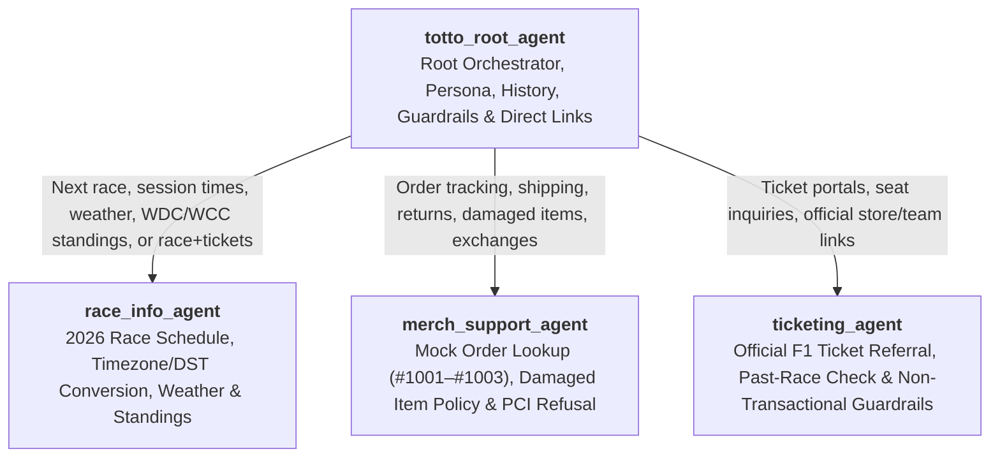

# Totto, Mercedes F1 Fan Agent — Multi-Agent Architecture & Tool Design

## 1. Multi-Agent Conversational Topology

**Totto, Mercedes F1 Fan Agent** (`totto-mercedes-f1-fan-agent`) uses a hierarchical 4-agent topology governed by `totto_root_agent`. All 4 agents share a single unified persona (`global_instruction.txt` + `lib/shared_prompts/persona.txt`) so fans experience one seamless conversational assistant without internal agent names (`race_info_agent`, `merch_support_agent`, `ticketing_agent`) ever leaking into responses.

### Agent Responsibilities & Tool Wiring

| Agent | Role | Attached Tools | Callbacks |
|---|---|---|---|
| **[`totto_root_agent`](../cxas_app/agents/totto_root_agent/instruction.txt)** | Root orchestrator, greeting (`<welcome>` in English), Toto Wolff non-impersonation (`PRD-AC8`), brand-safe rivalry banter (`PRD-AC9`), qualified Mercedes F1 history (`PRD-AC3`), out-of-scope/safety refusals, and silent routing. | `get_official_links`, `end_session` | `before_agent_callbacks`: [`init_session_state`](../cxas_app/agents/totto_root_agent/before_agent_callbacks/init_session_state/python_code.py) |
| **[`race_info_agent`](../cxas_app/agents/race_info_agent/instruction.txt)** | 2026 FIA Formula 1 race calendar, session start times (`Practice 1–3`, `Qualifying`, `Race`), `zoneinfo` local timezone + seasonal DST conversion (`PRD-AC1`, `PRD-AC7`), typical circuit weather, and Mercedes-first WDC/WCC standings (`PRD-AC2`). | `get_race_schedule`, `get_driver_standings`, `get_official_links`, `end_session` | `after_tool_callbacks`: [`sync_race_state`](../cxas_app/agents/race_info_agent/after_tool_callbacks/sync_race_state/python_code.py) |
| **[`merch_support_agent`](../cxas_app/agents/merch_support_agent/instruction.txt)** | Simulated (`mock`) merchandise order lookup (`#1001`, `#1002`, `#1003` valid; `#9999` not found; `PRD-AC5`), 30-day damaged-item replacement guidance, and strict PCI credit-card refusal. | `lookup_mock_merch_order`, `get_official_links`, `get_race_schedule`, `end_session` | `after_tool_callbacks`: [`sync_merch_state`](../cxas_app/agents/merch_support_agent/after_tool_callbacks/sync_merch_state/python_code.py) |
| **[`ticketing_agent`](../cxas_app/agents/ticketing_agent/instruction.txt)** | Official Formula 1 ticket portal referral (`https://tickets.formula1.com`, `https://www.mercedesamgf1.com`; `PRD-AC4`), past-race completion check (`is_completed=true`), and non-transactional guardrails. | `get_official_links`, `get_race_schedule`, `end_session` | — |

---

## 2. Session State Schema (`app.json`)

Session variables are declared in [`cxas_app/app.json`](../cxas_app/app.json) and initialized on every turn by [`init_session_state`](../cxas_app/agents/totto_root_agent/before_agent_callbacks/init_session_state/python_code.py):

| Variable | Type | Initialized By | Updated By | Purpose |
|---|---|---|---|---|
| `is_mock_mode` | `boolean` | `init_session_state` (`True`) | — | Marks merchandise order lookups as simulated demo data (`PRD-AC5`). |
| `user_timezone` | `string` | `init_session_state` (`""`) | `sync_race_state` | Persists the fan's resolved IANA timezone (e.g., `Australia/Sydney`, `Europe/Berlin`) across multi-turn conversations. |
| `user_location` | `string` | `init_session_state` (`""`) | `sync_race_state` | Remembers the fan's stated city or country across turns (`PRD-AC7`). |
| `order_id` | `string` | `init_session_state` (`""` or regex match) | `sync_merch_state` | Extracts 4–8 digit order IDs (`1001`, `ORD-1002`) in English, German (`Bestellnummer`), French (`commande`), and Spanish (`pedido`) while ignoring driver numbers (`#63`, `#12`, `#1`). |

---

## 3. Tool Architecture & Offline Mock Tool Fakes (`toolFakeConfig`)

All 4 tools in [`cxas_app/tools/`](../cxas_app/tools) provide both a production serverless Python function (`python_function/python_code.py`) and a zero-network deterministic mock tool fake (`tool_fake_config/code_block/python_code.py`) wired via `"toolFakeConfig"` in each tool's JSON definition:

1. **[`get_race_schedule`](../cxas_app/tools/get_race_schedule/python_function/python_code.py)**:
   - Queries OpenF1 (`api.openf1.org/v1/meetings` & `sessions`, 2s timeout) with automatic fallback to an embedded 23-round 2026 FIA calendar synced with [`tests/fixtures/openf1/`](../tests/fixtures/openf1) (including `1308` Kuala Lumpur Oct 2–4 and excluding cancelled rounds `1282` Sakhir & `1283` Jeddah).
   - Resolves ~600 IANA timezones via Python `zoneinfo` plus city/abbreviation aliases (`Sydney`, `Berlin`, `Edinburgh`, `Kuala Lumpur`, etc.) with real seasonal Daylight Saving Time (`AEDT` UTC+11 in October vs `AEST` UTC+10 in July).
   - Uses word-boundary matching (`\b...\b`) so `"Spain"` resolves to `Spanish Grand Prix (Madrid)` and never collides with `"spa"` (`Belgian Grand Prix`).
   - Returns `is_completed` (`bool`), `meeting_state` (`"completed"` vs `"upcoming"`), and `typical_weather` (`source="typical_circuit_climate_profile"`).
2. **[`get_driver_standings`](../cxas_app/tools/get_driver_standings/python_function/python_code.py)**:
   - Supports `category` values `"all"`, `"both"`, `"drivers"`, `"constructors"`, and `"mercedes"`.
   - Rejects non-2026 seasons (`season != 2026`) with `status="error"` (`agent_action="EXPLAIN_ONLY_2026_SEASON_SUPPORTED"`) so 2026 data is never mislabeled as a historical season.
   - Highlights Mercedes-AMG Petronas (`P1` Constructors, `412` pts), George Russell (`#63`, `P2`, `228` pts), and Kimi Antonelli (`#12`, `P4`, `184` pts) first (`PRD-AC2`).
3. **[`lookup_mock_merch_order`](../cxas_app/tools/lookup_mock_merch_order/python_function/python_code.py)**:
   - Normalizes `#1001`, `ORD-1001`, or `1001` into canonical catalog keys (`1001` Delivered cap, `1002` In Transit polo, `1003` Processing model car) and returns `is_mock_data=True` (`PRD-AC5`).
4. **[`get_official_links`](../cxas_app/tools/get_official_links/python_function/python_code.py)**:
   - Returns verified official HTTPS portals (`https://www.mercedesamgf1.com`, `https://shop.mercedesamgf1.com`, `https://tickets.formula1.com`) across `all`, `ticketing`, `merch`/`store`/`shop`, and `team` categories (`PRD-AC4`).
