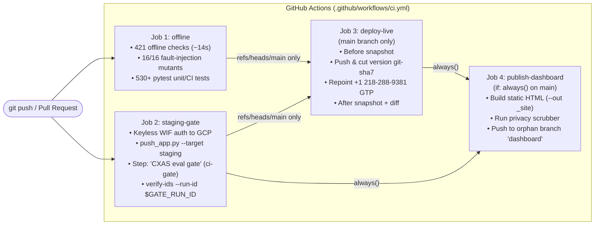

# Continuous Integration, Staging Gate & Live Deployment (`docs/ci-cd.md`)

This guide explains how every code change in the **Totto Agent** repository is automatically tested, verified against a real cloud staging environment, deployed to the live production agent (including the `+1 218-288-9381` phone line), and published to the public evaluation dashboard.

---

## 1. Plain-English Overview of the 4-Job Pipeline

Every push to `main` and every pull request runs the 4-stage GitHub Actions workflow defined in [`.github/workflows/ci.yml`](../.github/workflows/ci.yml). Notice that `offline` and `staging-gate` start **in parallel** so a prompt-only regression is immediately tested on the cloud `"CXAS eval gate"` step without waiting for local mutation tests to finish first:



### Summary of the 4 Jobs in `.github/workflows/ci.yml`

| Job ID | Runs When | What It Executes | Why It Exists |
| :--- | :--- | :--- | :--- |
| **`offline`** | Every push & PR (in parallel with `staging-gate`) | 1. `python scripts/bundle_shared_imports.py --check`<br/>2. `cxas lint --app-dir cxas_app`<br/>3. `python -m pytest -q` (**530+** unit, CI, dashboard, and acceptance tests)<br/>4. `python -m totto_suite offline --no-record` (8 layers, **421 checks**)<br/>5. `python -m totto_suite mutants` (**16/16** fault-injection mutants killed) | Catches syntax errors, schema drift, broken callbacks, timezone bugs, prompt anti-patterns, and grader regressions in ~15 seconds. |
| **`staging-gate`** | Every push & PR (in parallel with `offline`) | 1. Authenticates via keyless Workload Identity Federation (`google-github-actions/auth`)<br/>2. Runs [`python scripts/ci/push_app.py --target staging --json-out staging_push.json`](../scripts/ci/push_app.py) to push `cxas_app/` to `$CXAS_STAGING_APP_ID` (injecting `$CXAS_EVAL_AUDIO_BUCKET` into a temp directory if set and persisting `model_settings` + `audio_processing_config`)<br/>3. Runs step **`"CXAS eval gate"`**: `python -m totto_suite ci-gate --target staging --app-name "$STAGING_APP_NAME" --run-id "$GATE_RUN_ID" --tool-mode fake --out gate_summary.json`<br/>4. Runs `python -m totto_suite verify-ids --app-name "$STAGING_APP_NAME" --run-id "$GATE_RUN_ID"`<br/>5. Uploads artifacts **`gate-summary`** (`gate_summary.json`) and **`gate-records`** (`staging_push.json`, `baseline.json`, `evals/history/runs/$GATE_RUN_ID.json`, `evals/history/artifacts/$GATE_RUN_ID/`) | Verifies that the real Google Cloud CX Agent Studio runtime executes every tool, golden conversation, and multi-turn user simulation above strict pass-rate floors, and confirms every recorded evaluation/conversation ID resolves on the server. |
| **`deploy-live`** | Only on `push` to `refs/heads/main` after **both** `offline` and `staging-gate` pass | 1. Runs [`python scripts/ci/deploy_live.py --out-dir deploy_out --gate-run-id "$GATE_RUN_ID" --gate-verdict "$GATE_VERDICT"`](../scripts/ci/deploy_live.py) against `$CXAS_LIVE_APP_ID`<br/>2. Captures a pre-deploy snapshot, pushes `cxas_app/`, cuts immutable version `git-<sha7>` (`--create-version`), repoints the live `GOOGLE_TELEPHONY_PLATFORM` deployment (`+1 218-288-9381`), and captures a post-deploy snapshot + diff (`deploy_out/deploy.json`, `deploy_out/diff.md`, `deploy_out/diff.json`)<br/>3. Uploads artifacts **`deploy-record`** and **`live-snapshots`** | Ensures the live production app and telephone line are **only** updated by automated CI after `staging-gate` passes, with an immutable version tag and before/after audit trail. |
| **`publish-dashboard`** | `if: always()` on `main` after `staging-gate` (and `deploy-live`) | 1. Downloads **`gate-summary`** and **`deploy-record`** artifacts<br/>2. Runs `python -m totto_suite dashboard build --out _site`<br/>3. Runs [`bash scripts/publish_dashboard.sh _site`](../scripts/publish_dashboard.sh) to publish the scrubbed static site to the orphan `dashboard` branch (serving GitHub Pages at [`https://snehsm007.github.io/totto-agent/`](https://snehsm007.github.io/totto-agent/)) | Publishes updated pass/fail run history, turn-by-turn transcripts, and live version metadata to the public dashboard even when a gate fails (so engineers can inspect failure traces immediately in their browser). |

---

## 2. Keyless Cloud Authentication (Workload Identity Federation)

We never store long-lived service account JSON keys in GitHub or git. Instead, GitHub Actions authenticates to Google Cloud using **Workload Identity Federation (WIF)**:
1. GitHub's OpenID Connect (OIDC) provider issues a short-lived cryptographic token scoped to `repo:snehsm007/totto-agent`.
2. `google-github-actions/auth` exchanges that OIDC token with Google Cloud IAM (`GCP_WIF_PROVIDER`) to impersonate the CI service account (`GCP_CI_SERVICE_ACCOUNT`) for the duration of the job.

### Required GitHub Actions Repository Variables
All environment identifiers are stored as GitHub Actions **Repository Variables** (`Settings -> Secrets and variables -> Actions -> Variables`) and validated by [`scripts/ci/check_repo_vars.sh`](../scripts/ci/check_repo_vars.sh):

| GitHub Repository Variable | Required? | Purpose |
| :--- | :--- | :--- |
| **`GCP_WIF_PROVIDER`** | Required | Full Workload Identity Provider resource path (`projects/<PROJECT_NUMBER>/locations/global/workloadIdentityPools/<POOL>/providers/<PROVIDER>`). |
| **`GCP_CI_SERVICE_ACCOUNT`** | Required | Email of the least-privilege CI service account (`<sa-name>@<project-id>.iam.gserviceaccount.com`). |
| **`CXAS_STAGING_APP_ID`** | Required | Full CXAS resource name (or UUID) of the permanent non-production **Staging App** used by `staging-gate` (`projects/<PROJECT_ID>/locations/us/apps/<STAGING_APP_UUID>`). |
| **`CXAS_LIVE_APP_ID`** | Required | Full CXAS resource name (or UUID) of the production **Live App** updated by `deploy-live` (`projects/<PROJECT_ID>/locations/us/apps/<LIVE_APP_UUID>`). |
| **`CXAS_EVAL_AUDIO_BUCKET`** | Optional | GCS bucket name (without `gs://`) where [`scripts/ci/push_app.py`](../scripts/ci/push_app.py) templates `loggingSettings.evaluationAudioRecordingConfig.gcsBucket` (`gs://<bucket>`) and `gcsPathPrefix` (`ces-eval-audio/$session`) for voice evaluations. |

---

## 3. Staging Evaluation Gate (`totto_suite ci-gate`) & Thresholds

The cloud staging gate is implemented in [`totto_suite/ci_gate.py`](../totto_suite/ci_gate.py) and [`totto_suite/gate_rule.py`](../totto_suite/gate_rule.py), and thresholds are configured in [`totto_suite/gate_thresholds.json`](../totto_suite/gate_thresholds.json).

### 3.1 Dual-Mode Execution (`--tool-mode fake` vs. `--tool-mode real`)
`python -m totto_suite ci-gate` supports two tool execution modes:
- **`--tool-mode fake` (Default CI Staging Gate)**: Runs `live_tools` (`use_tool_fakes=True`), `live_goldens` (`toolCallBehaviour=FAKE`), and `live_sims` (`toolCallBehaviour=FAKE`) with `repeats=2`. Because `toolFakeConfig.enableFakeMode` is enabled on all 4 tools, CXAS executes `fake_tool_call` inside `tool_fake_config/code_block/python_code.py` and emits `"Fake Tool"` spans in the execution trace (`fake_verified=True`).
- **`--tool-mode real` (Live Integration Mode)**: Runs `live_tools`, `live_goldens`, and `live_sims` with `toolCallBehaviour=REAL`, exercising the production `python_function/python_code.py` code paths.

### 3.2 Pass-Rate Floors (`totto_suite/gate_thresholds.json`)

| Threshold Setting in `gate_thresholds.json` | `--tool-mode fake` | `--tool-mode real` | What It Enforces in Cloud CXAS |
| :--- | :---: | :---: | :--- |
| **`overall_floor`** | **95.0%** (`0.95`) | **90.0%** (`0.90`) | Minimum combined pass rate (`PASS / (PASS + FAIL)`) across all gated cloud checks. |
| **`layer_floors.live_tools`** | **95.0%** (`0.95`) | **90.0%** (`0.90`) | Direct cloud tool execution (`tools:executeTool`) across all tool test probes. |
| **`layer_floors.live_goldens`** | **80.0%** (`0.80`) | **80.0%** (`0.80`) | Replay of golden multi-turn conversations (`run_evaluation`) combined with our deterministic transcript grader. |
| **`layer_floors.live_sims`** | **70.0%** (`0.70`) | **70.0%** (`0.70`) | Multi-turn persona user simulations (`run_simulation`) graded by our 18-check deterministic transcript grader + platform expectations. |
| **`baseline_tolerance_pp`** | **10.0 pp** (`10.0`) | **10.0 pp** (`10.0`) | Maximum permitted pass-rate drop (in percentage points) relative to `baseline.json` before flagging a regression. |
| **`max_new_failures`** | **`1`** | **`1`** | Maximum number of previously passing scenarios allowed to flip `PASS -> FAIL` relative to `baseline.json`. |
| **`max_infra_ratio`** | **25.0%** (`0.25`) | **25.0%** (`0.25`) | Maximum share of checks failing with transient cloud `429`/`503`/`504` errors before marking the run `INCONCLUSIVE`. |

### 3.3 Exit Codes of `totto_suite ci-gate`
- **Exit `0` (`PASS`)**: Every layer met or exceeded its floor in `gate_thresholds.json` within `baseline_tolerance_pp` and `max_new_failures`.
- **Exit `1` (`FAIL`)**: One or more layers fell below its positive floor (or regressed beyond `baseline_tolerance_pp` / `max_new_failures` or failed `fake_verified`). Blocks merge and blocks `deploy-live`.
- **Exit `2` (Configuration / Usage Error)**: Bad CLI arguments or missing configuration.
- **Exit `3` (`INCONCLUSIVE`)**: More than `max_infra_ratio` (`25%`) of checks failed due to transient cloud infrastructure errors (`429 RESOURCE_EXHAUSTED`, `503`, `504`). Still fails the CI step (non-zero exit code) so unverified code never deploys to live.

---

## 4. Server ID Verification (`totto_suite verify-ids`)

Right after `ci-gate` finishes in `staging-gate`, the workflow runs:
```bash
python -m totto_suite verify-ids --app-name "$STAGING_APP_NAME" --run-id "$GATE_RUN_ID"
```
- **What it checks**: [`totto_suite/verify_ids.py`](../totto_suite/verify_ids.py) loads the run record (`evals/history/runs/$GATE_RUN_ID.json`), rehydrates every app-relative `evaluationRuns/<uuid>`, `conversations/<uuid>`, and `versions/<uuid>` against `--app-name` (or the default local config app resource), and queries the live CXAS API (`get_evaluation_run`, `get_conversation`, `get_app_version`) to prove every resource ID genuinely exists on the server.
- **Why it runs immediately after `ci-gate`**: Pushing a new app bundle (`cxas push --overwrite`) to the staging app replaces staging resources. Running `verify-ids` immediately after `ci-gate` in the same job guarantees 100% of resource IDs from that run are verified live and written to `evals/history/artifacts/$GATE_RUN_ID/verify_ids.json`.

---

## 5. Automated Live Deployment (`scripts/ci/deploy_live.py`)

When a commit merges to `main` and passes both `offline` and `staging-gate`, the `deploy-live` job runs [`scripts/ci/deploy_live.py`](../scripts/ci/deploy_live.py):
1. **Pre-Deploy Snapshot**: Exports the live app's current state and version inventory into `deploy_out/before/`.
2. **Push & Cut Immutable Version (`git-<sha7>`)**: Pushes `cxas_app/` to `$CXAS_LIVE_APP_ID` and creates an immutable CXAS `Version` resource named `git-<sha7>` (recording the commit SHA and staging gate run ID in its description).
3. **Repoint Live Telephone Deployment (`+1 218-288-9381`)**: Queries `GET .../apps/<LIVE_APP_ID>/deployments`, locates the `GOOGLE_TELEPHONY_PLATFORM` deployment (`deployments/0ba8f03a-11db-4539-93f2-7e4a1893ea85`), and sends a `PATCH` (`updateMask=appVersion`) so live phone callers immediately reach the new `git-<sha7>` version.
4. **Post-Deploy Snapshot & Diff**: Exports `deploy_out/after/` and writes `deploy_out/deploy.json`, `deploy_out/diff.md`, and `deploy_out/diff.json`.

### Why Manual Local Push/Deploy Targets Were Removed
To prevent unreviewed local code from overwriting the shared live app:
- `Makefile` does **not** include `make push`, `make pull`, or `make deploy` (only `make push-staging`, which verifies the target app's `displayName` ends with `-staging` and refuses to touch live).
- Running `python -m totto_suite deploy --push` locally refuses to push and exits with code **`2`**, instructing the developer to push a branch/PR so GitHub Actions deploys through `staging-gate` $\rightarrow$ `deploy-live`.

---

## 6. Proving Gate Efficacy: 16 Offline Mutants + 1 Live Staging Mutant

How do we know our tests and CI gates actually catch bugs instead of rubber-stamping every commit? We test the test suite itself using **fault-injection mutants**:

### 6.1 The 16 Offline Fault-Injection Mutants (`make mutants`)
Running `.venv/bin/python -m totto_suite mutants` (or `make mutants`) injects **16 distinct defects** across `tools` (6), `callbacks` (3), and `config` (7), confirming **16/16 (100.0%)** are killed by the offline suite ([`evals/history/mutants/mutants_report.md`](../evals/history/mutants/mutants_report.md)):
- **6 `tools` mutants**: `mutant_tr08_standings_both_alias`, `mutant_tb03_unknown_race_fallback`, `mutant_tr10_broken_timezone_dst`, `mutant_rc01_missing_merch_store_link`, `mutant_tr09_missing_freshness_disclaimer`, `mutant_bundle_openf1_helper_drift`.
- **3 `callbacks` mutants**: `mutant_cb_order_id_regex`, `mutant_cb_sync_race_state_noop`, `mutant_voice_sanitizer_noop`.
- **7 `config` mutants**: `mutant_tr01_prompt_stuffed_example`, `mutant_tr02_speak_phrase_in_tool_desc`, `mutant_rc02_toto_impersonation_and_drop`, `mutant_rc11_invalid_app_schema`, `mutant_bundle_persona_drift`, `mutant_voice_guidelines_dropped`, `mutant_repetitive_boilerplate_mantra`.

### 6.2 The Live-Only Cloud Mutant (`scripts/ci/apply_live_mutant.sh`)
What if someone introduces a semantic prompt regression that passes all 421 offline static checks—for example, instructing `race_info_agent` in plain prose to refuse all 2026 calendar lookups while keeping every PIF XML tag, tool link, and callback intact?
- [`evals/mutants/live/race_schedule_blackout.patch`](../evals/mutants/live/race_schedule_blackout.patch) (applied via [`scripts/ci/apply_live_mutant.sh`](../scripts/ci/apply_live_mutant.sh)) injects that exact semantic bug.
- All 421 offline checks pass (`0` failures), so the `offline` job turns green—and then the cloud `staging-gate` job (**`"CXAS eval gate"`**) catches the regression (`live_goldens` drops to `0.50 < 0.80`, `live_sims` drops to `0.571 < 0.70`), exits with code `1`, and blocks `deploy-live` from ever touching production.

---

## 7. Local Developer Setup & Git Pre-Commit Hook (`make setup`, `make hooks`)

Run these commands once after cloning the repository:
```bash
# 1. Create .venv, install dependencies, and activate hooks/pre-commit
make setup

# 2. Run the 8-layer (421-check) offline verification suite (~14 seconds)
make offline
```
- [`make hooks`](../Makefile) sets `git config core.hooksPath hooks`, enabling [`hooks/pre-commit`](../hooks/pre-commit), which runs `python -m totto_suite gate` before every commit (`evals/history/gate/gate_demo.log`).
