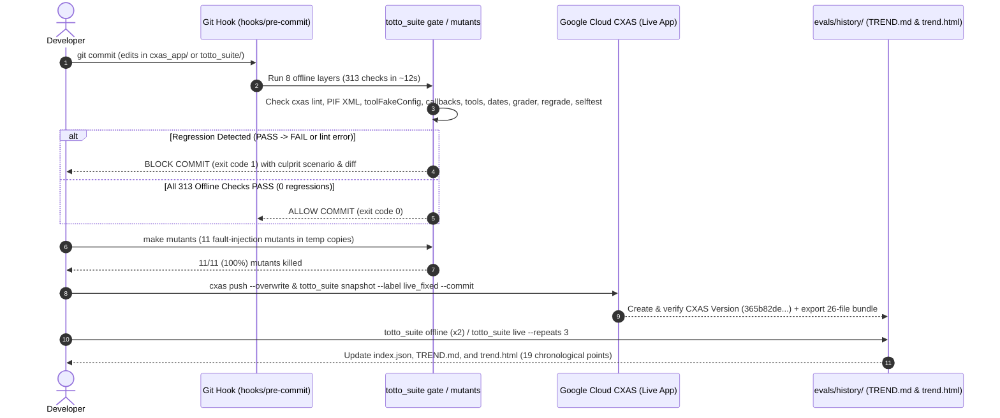

# CI/CD, Pre-Commit Regression Gate & CXAS Version Snapshot Pipeline

## 1. End-to-End Verification & Deployment Pipeline

`totto_suite` provides a two-track quality and version-tracking pipeline:
1. **Track 1 — Fast Hermetic Offline Gate (`< 15s`, zero cloud calls)**: Runs on every `git commit` via [`hooks/pre-commit`](../hooks/pre-commit) (`totto_suite gate`) and `make ci`.
2. **Track 2 — Version-Linked Live CXAS Evaluation & Snapshot Tracking**: Links every `git commit` to an immutable CXAS `Version` (`totto_suite snapshot` / `totto_suite deploy`) and records 7-layer live evaluations (`repeats=3`, `parallel=1`) with automatic `INFRA_ERROR` separation.

---

## 2. Track 1: Pre-Commit Ratchet Gate (`totto_suite gate`)

Implemented in [`totto_suite/gate.py`](../totto_suite/gate.py) and wired into Git via [`hooks/pre-commit`](../hooks/pre-commit), the gate compares candidate verdicts across all **8 offline layers** (`313` checks) against the baseline commit (`HEAD:cxas_app`):

| Blocking Condition | Exit Code | Behavior |
|---|---:|---|
| **`lint` Failure** | `1` (Blocked) | Blocks if `cxas lint` or `bundle_shared_imports.py --check` reports any error. |
| **`PASS -> FAIL` Regression** | `1` (Blocked) | Blocks if any offline test that passed on the baseline commit flips to `FAIL`. |
| **`selftest` / `grader` / `regrade` Failure** | `1` (Blocked) | Blocks if any deterministic transcript grader or suite self-test fails. |
| **Suite Crash** | `2` (Blocked) | Blocks if any layer crashes or raises an unhandled exception. |
| **Clean (`313/313 PASS`)** | `0` (Passed) | Allows the commit to proceed (~12 seconds total wall time). |

See [`evals/history/gate/gate_demo.log`](../evals/history/gate/gate_demo.log) for a recorded end-to-end transcript of `git commit` blocking a deliberately broken change (`exit 1`) and allowing a clean change (`exit 0`).

---

## 3. Fault-Injection Mutation Testing (`totto_suite mutants`)

To prove the offline gate catches real agent bugs rather than vacuous assertions, [`totto_suite/mutants.py`](../totto_suite/mutants.py) injects **11 realistic defects** into isolated temporary copies of `cxas_app/` (never touching the working tree):

- **5 Tool Mutants**: `mutant_tr08_standings_both_alias`, `mutant_tb03_unknown_race_fallback`, `mutant_tr10_broken_timezone_dst`, `mutant_rc01_missing_merch_store_link`, `mutant_tr09_missing_freshness_disclaimer`.
- **2 Callback Mutants**: `mutant_cb_order_id_regex`, `mutant_cb_sync_race_state_noop`.
- **4 Config & Prompt Mutants**: `mutant_tr01_prompt_stuffed_example`, `mutant_tr02_speak_phrase_in_tool_desc`, `mutant_rc02_toto_impersonation_and_drop`, `mutant_rc11_invalid_app_schema`.

All **11/11 (`100.0%`)** mutants are killed against the `0 FAIL` baseline (full report in [`evals/history/mutants/mutants_report.md`](../evals/history/mutants/mutants_report.md)).

---

## 4. Track 2: CXAS Version Snapshots & Quota-Safe Live Evaluation

Every evaluation run record in [`evals/history/runs/`](../evals/history/runs) conforms to schema v1 ([`totto_suite/records.py`](../totto_suite/records.py)) and links:
- **`agent.commit` & `agent.tree_hash`**: Exact Git SHA and SHA-256 content digest of `cxas_app/`.
- **`cxas.version_id` & `cxas.version_status`**: Immutable CXAS `Version` UUID (`in_version_list`, `hidden_fetchable`, or `not_deployed`).
- **`infra_errors` Separation**: HTTP `429 RESOURCE_EXHAUSTED`, `503 Service Unavailable`, `504 Deadline Exceeded`, and network timeouts are classified as `INFRA_ERROR` and excluded from `PASS / (PASS + FAIL)` layer scores so model quota spikes never look like agent regressions.
