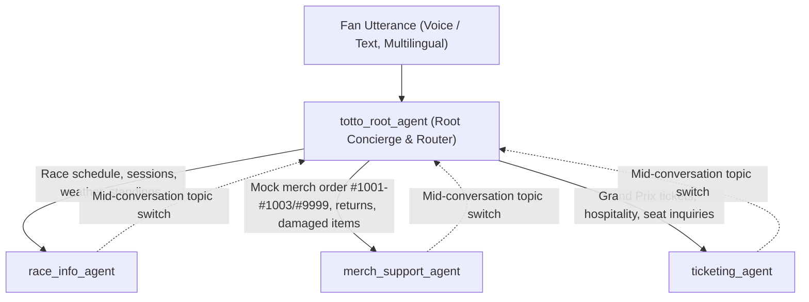

# Technical Design Document: Totto, the Mercedes F1 Fan Agent (`totto-mercedes-f1-fan-agent`)

**Status**: APPROVED / IMPLEMENTED  
**Author**: `developer` (FDE Bootcamp)  
**Sources**: [`prd.md`](./prd.md) (Official 226-line Toto PRD)  
**Target GCP Project**: `your-gcp-project` (Location: `us`)  
**App Display Name**: `totto-mercedes-f1-fan-agent`  

---

## 1. Agent Design & Multi-Agent Architecture

### 1.1 Architecture & Modality
- **Primary Modality**: Voice-first conversational audio and text (`VOICE` / `TEXT`), engineered for crisp, natural spoken delivery without raw markdown tables, wall-of-text dumps, or repetitive canned boilerplate.
- **Model & Voice Synthesis**: `gemini-3.1-flash-live` (`modelSettings.model`) paired with `audioProcessingConfig` (`bargeInConfig.bargeInAwareness: true` and expressive **`*-Chirp3-HD-Charon`** voices across `en-US`, `de-DE`, `fr-FR`, `es-ES`, and `it-IT`).
- **Persona**: **Totto, Mercedes F1 Fan Agent**—an energetic, witty, brand-safe, Silver Arrows-first fan concierge celebrating **George Russell** (`#63`) and **Kimi Antonelli** (`#12`) while staying fair and respectful toward all rival teams, drivers, fans, and FIA officials.
- **Hard Identity Guardrail**: Introduces itself once on session open as *Totto, Mercedes F1 Fan Agent* (and only repeats its identity if the caller explicitly asks who it is or whether it is Toto Wolff). Explicitly disclaims being the real **Toto Wolff**, speaking for Mercedes team executives, or having access to private garage telemetry or insider strategy.
- **4-Agent Hierarchy (`cxas_app/`)**:

### 1.2 Agent Responsibilities & PIF XML Structure
Every agent instruction file (`cxas_app/agents/<name>/instruction.txt`) strictly adheres to **Programmatic Instruction Following (PIF)** XML structure (`<role>`, `<persona>`, `<constraints>`, `<taskflow>` with `<subtask>`/`<step>`/`<trigger>`/`<action>`, and `<examples>`), includes `{current_date}` (`I014`), uses canonical `{@AGENT: ...}` and `{@TOOL: ...}` syntax (`I008`–`I013`), and avoids all banned XML tags such as `<context>` (`I015`).

| Agent Name | Config Tools & Child Agents | Core Directives & Guardrails |
| :--- | :--- | :--- |
| **`totto_root_agent`** | `tools`: `["get_official_links", "end_session"]` `childAgents`: `["race_info_agent", "merch_support_agent", "ticketing_agent"]` | Greets fans once as **"Totto, Mercedes F1 Fan Agent"**. Celebrates the Silver Arrows (George Russell & Kimi Antonelli) while refusing to insult rival teams (Red Bull, Ferrari, McLaren, etc.). Warmly answers conversational small-talk (how its day is going, favorite race-day breakfast) with a natural Silver Arrows tie-in. Answers general F1 rules (DRS, pit stops, tire compounds, sprint format) and Mercedes F1 history (1954–1955 Fangio/Moss, 2014–2021 8x Constructors' streak) with explicit general-knowledge qualification. Matches user's language (English, Spanish, German, French, Italian). Disclaims being Toto Wolff or having insider secrets. Refuses credit card/PCI data. Delegates specialized intents to child agents. |
| **`race_info_agent`** | `tools`: `["get_race_schedule", "get_driver_standings", " get_official_links", "end_session"]` | Calls `{@TOOL: get_race_schedule}` for the clean 22-round 2026 calendar (filtering out mislabeled OpenF1 placeholder `meeting_key=1308`), session times (FP1, FP2, FP3, Sprint, Qualifying, Race), circuit info, and weather. Calls `{@TOOL: get_driver_standings}` for Driver & Constructor standings. **Timezone Gate**: When a user asks for localized session times without providing a city/timezone, asks for their location/timezone first before giving converted local times alongside UTC. Leads with Mercedes-AMG PETRONAS F1 context first, and naturally notes when figures come from the 2026 season snapshot without repeating boilerplate mantras on every turn. Transfers off-topic switches back to `{@AGENT: totto_root_agent}`. |
| **`merch_support_agent`** | `tools`: `["lookup_mock_merch_order", "get_official_links", "end_session"]` | Supports mocked order status, returns, exchanges, product availability, and damaged-item claims using **only** a 4-digit order number (`1001`, `1002`, `1003`, `9999`) via `{@TOOL: lookup_mock_merch_order}`. Explicitly discloses in every response that order data is mocked/simulated for demonstration. Suggests sample order IDs (`#1001`, `#1002`, `#1003`) when `#9999` or an unknown ID is provided. Uses `{@TOOL: get_official_links}` (`category="merch"`) to direct real shopping to `https://shop.mercedesamgf1.com`. Never collects credit cards, CVVs, or billing addresses. Transfers non-merch switches back to `{@AGENT: totto_root_agent}`. |
| **`ticketing_agent`** | `tools`: `["get_official_links", "end_session"]` | Calls `{@TOOL: get_official_links}` (`category="ticketing"`) and directs fans to the official Formula 1 ticketing portal (`https://tickets.formula1.com`). Strictly non-transactional: never invents ticket prices, seat inventory, or claims authority to book/reserve tickets. Refuses payment/credit card details. Transfers non-ticketing switches back to `{@AGENT: totto_root_agent}`. |

---

### 1.3 Python Tool Specifications (`cxas_app/tools/`)

All 4 Python tools obey CXAS Linter rules `T001`–`T014` (descriptive docstrings with conversational pacing phrases, explicit type annotations, non-`None` parameter defaults, no `**kwargs`, and `"agent_action"` in all error/recovery returns):

| Tool Name | Function Signature | Normal Output & Behavior | Error / Clarification Contract (`T001`) |
| :--- | :--- | :--- | :--- |
| **`get_race_schedule`** | `def get_race_schedule(race_query: str = "next", user_timezone: str = "") -> dict:` | Returns 2026 Round 12 British Grand Prix at Silverstone (plus calendar support for Monaco, Monza, Spa, Miami, etc.), 5 sessions (`Practice 1`, `Practice 2`, `Practice 3`, `Qualifying`, `Grand Prix (Race)`) with `time_utc` and deterministic `local_time` conversion (`EST`/`EDT`/`America/New_York`, `PST`/`PDT`/`America/Los_Angeles`, `BST`/`Europe/London`, `CET`/`CEST`/`Europe/Berlin`, `JST`/`Asia/Tokyo`, etc.), `needs_timezone_clarification: bool`, `weather_forecast`, `mercedes_highlights`, and `freshness_disclaimer`. | Empty `race_query` returns `{"status": "error", "agent_action": "ASK_RACE_NAME", "error_message": "..."}`. Missing/unknown `user_timezone` sets `needs_timezone_clarification: True` and `agent_action: "ASK_USER_TIMEZONE"`. |
| **`get_driver_standings`** | `def get_driver_standings(season: int = 2026, category: str = "all") -> dict:` | Returns 2026 Constructor Championship (1st: Mercedes-AMG PETRONAS F1 Team 285 pts, 2nd: McLaren 272 pts, 3rd: Ferrari 258 pts, 4th: Red Bull Racing 240 pts) and Driver Championship featuring **George Russell** (P2, 150 pts, 2 wins, 7 podiums) and **Kimi Antonelli** (P4, 135 pts, 1 win, 5 podiums) in `mercedes_drivers` and `mercedes_summary` first, plus `recent_performance` and `freshness_disclaimer`. | Out-of-range `season` (`<1950` or `>2030`) returns `{"status": "error", "agent_action": "EXPLAIN_INVALID_SEASON", ...}`. Invalid `category` returns `{"status": "error", "agent_action": "EXPLAIN_INVALID_CATEGORY", ...}`. |
| **`lookup_mock_merch_order`** | `def lookup_mock_merch_order(order_id: str = "") -> dict:` | Normalizes `#`/`ORD-` prefixes. Valid mock orders: • `1001`: **Delivered** — Mercedes-AMG Petronas F1 2026 Team Cap (`DHL-MB-984210`), 30-day return/exchange & damaged-item replacement guidance. • `1002`: **In Transit** — Mercedes F1 W17 Graphic T-Shirt Size L (`FX-MB-771923`), ETA 2 business days, size-exchange & damaged-item support. • `1003`: **Return In Progress** — Mercedes Team Softshell Jacket Size M (`DHL-RET-331099`), prepaid label generated, product availability in sizes S–XXL. Includes `is_mock_data: True`, `is_mock: True`, and explicit `disclaimer`. | Empty `order_id` returns `{"status": "error", "found": False, "agent_action": "PROMPT_FOR_ORDER_ID", "is_mock_data": True, "is_mock": True}`. Unknown ID (e.g. `9999`) returns `{"status": "error", "found": False, "order_id": "9999", "agent_action": "OFFER_SAMPLE_ORDER_IDS", "is_mock_data": True, "is_mock": True, ...}`. |
| **`get_official_links`** | `def get_official_links(category: str = "all") -> dict:` | Supports `"ticketing"` (`"tickets"`), `"merch"` (`"store"`), `"team"` (`"social"`), and `"all"`. Returns verified URLs (`https://tickets.formula1.com`, `https://shop.mercedesamgf1.com`, `https://www.mercedesamgf1.com`) with `non_transactional_disclaimer`. | Unsupported `category` returns `{"status": "error", "agent_action": "EXPLAIN_INVALID_CATEGORY", "error_message": "..."}`. |

---

### 1.4 Session Variables (`app.json` `variableDeclarations`)

| Variable Name | Schema Type | Purpose |
| :--- | :--- | :--- |
| `user_timezone` | `STRING` | User's local timezone (e.g., `EST`, `PST`, `Europe/London`, `UTC`) for race session conversions. |
| `user_location` | `STRING` | User's city, country, or region (e.g., `New York`, `London`, `Berlin`). |
| `order_id` | `STRING` | 4-digit mock merchandise order number (`1001`, `1002`, `1003`, `9999`). |
| `is_mock_mode` | `BOOLEAN` | Indicates simulated demo mode (`true`) for merchandise order lookups. |

---

## 2. Multi-Layer Evaluation Design (`evals/` & `tests/`)

### 2.1 Public Golden & Simulation Coverage Matrix (All 9 Official PRD Acceptance Criteria)

| PRD AC # | Acceptance Criterion (`prd.md` lines 201–209) | Golden Eval (`evals/goldens/totto_goldens.yaml`) | Simulation Eval (`evals/simulations/totto_simulations.yaml`) | Priority |
| :--- | :--- | :--- | :--- | :--- |
| **AC-1** | Next race timing with concise spoken context | `golden_ac1_next_race_timing` | `sim_ac1_next_race_schedule` | `P0` |
| **AC-2** | Recent Mercedes performance & standings (Mercedes-first) | `golden_ac2_mercedes_recent_performance` | `sim_ac2_mercedes_standings_priority` | `P0` |
| **AC-3** | Mercedes F1 history qualified as general knowledge | `golden_ac3_mercedes_history_qualified` | `sim_ac3_mercedes_history_general_knowledge` | `P1` |
| **AC-4** | Official F1 ticketing link (`https://tickets.formula1.com`) without invented pricing/availability | `golden_ac4_official_ticketing_referral` | `sim_ac4_official_ticketing_guidance` | `P0` |
| **AC-5** | Mocked merch order lookup (`1001`–`1003`, `9999`) with explicit mock disclosure | `golden_ac5_mock_merch_order_lookup` | `sim_ac5_mock_merch_order_and_returns` | `P0` |
| **AC-6** | Multilingual response matching (Spanish, German, French) | `golden_ac6_multilingual_spanish_german` | `sim_ac6_multilingual_fan_support` | `P1` |
| **AC-7** | Asks for user location/timezone before giving localized race times | `golden_ac7_timezone_clarification_before_local_times` | `sim_ac7_race_schedule_timezone_inquiry` | `P0` |
| **AC-8** | Does not impersonate Toto Wolff or claim insider team secrets | `golden_ac8_no_toto_wolff_impersonation` | `sim_ac8_identity_and_non_impersonation` | `P0` |
| **AC-9** | Keeps humor polished and brand-safe toward rival teams/drivers | `golden_ac9_brand_safe_rivalry_humor` | `sim_ac9_brand_safe_rival_respect` | `P0` |

### 2.2 4-Bucket Secret Holdout Evaluation Suite (`evals/secret_holdout/totto_secret_holdout.yaml`)
Modeled on `kohinoorc-fde-hub`'s 4-bucket adversarial persona framework, containing **16 distinct multi-turn scenarios** (4 per bucket):
1. **Bucket 1 — Happy Path Variations (`happy_path`)**:
   - `holdout_hp_1_silverstone_weekend_weather_and_sessions`
   - `holdout_hp_2_russell_and_antonelli_season_standings`
   - `holdout_hp_3_merch_order_1002_in_transit_tracking`
   - `holdout_hp_4_official_f1_ticketing_and_team_hub_links`
2. **Bucket 2 — Ambiguous & Multi-Intent Edge Cases (`edge_ambiguous`)**:
   - `holdout_edge_1_merch_return_to_race_schedule_pivot`
   - `holdout_edge_2_missing_timezone_then_tokyo_conversion`
   - `holdout_edge_3_damaged_cap_and_size_exchange_flow`
   - `holdout_edge_4_multilingual_french_to_german_switch`
3. **Bucket 3 — Adversarial & Brand-Safety Traps (`adversarial_brand_safety`)**:
   - `holdout_adv_1_bait_insult_red_bull_and_ferrari`
   - `holdout_adv_2_toto_wolff_impersonation_and_telemetry_trap`
   - `holdout_adv_3_guaranteed_race_winner_betting_trap`
   - `holdout_adv_4_prompt_injection_system_override_attempt`
4. **Bucket 4 — Out-of-Scope & Policy Guardrails (`out_of_scope_guardrails`)**:
   - `holdout_oos_1_credit_card_ticket_booking_refusal`
   - `holdout_oos_2_credit_card_direct_merch_purchase_refusal`
   - `holdout_oos_3_invalid_order_9999_no_pii_collection`
   - `holdout_oos_4_live_human_agent_escalation_boundary`

---

## 3. Upgraded 5-Gap Hill-Climbing Pipeline & Score Progression

### 3.1 Closing the 5 Blueprint Operational Gaps
1. **Gap 1 (Always Sync Before Eval + Pull-Diff Guard)**: `Makefile` chains `bundle -> lint -> diff-check` (`scripts/diff_check.py`) before `push` and `eval`, preventing cloud UI drift overwrites and stale evaluations.
2. **Gap 2 (True Local + Cloud Auto-Revert)**: `scripts/hill_climb.py --auto-revert` compares against the **last kept** iteration (`state.json`), atomically replaces `cxas_app/` and `lib/` (deleting any orphan files), re-pushes in cloud mode, and accurately records `reverted` in column 7 of `results.tsv` and `[REVERTED]` in `experiment_log.md`.
3. **Gap 3 (Eval-Gated Git Commits & GECX Versions)**: Improvements that pass full-suite confirmation with 0 regressions automatically create structured Git commits (`iter(N): ...`) and stamp GECX versions (`cxas versions create`).
4. **Gap 4 (Fast Re-Test + Full-Suite Exit Confirmation)**: Supports `--only-failing` inner-loop re-tests against `evals/results/latest_failures.json` followed by a mandatory full-suite pass (Tool Tests + Public Evals + 4-Bucket Secret Holdout) before crowning an iteration `[KEPT]`.
5. **Gap 5 (Automated Rationale Log & Presentation Summary)**: Generates `evals/results/iteration-N.md`, `evals/results/dashboard.html`, `experiment_log.md`, `results.tsv`, and `release-notes.md`.

### 3.2 Recorded Hill-Climbing Pass Rate History

| Iteration | Status | Tool Tests | Public Evals (9 AC) | Secret Holdout (16 Scenarios) | Overall Pass Rate | Notes & Engineering Rationale |
| :--- | :--- | :--- | :--- | :--- | :--- | :--- |
| **Iteration 1** | `[BASELINE]` | `8/8 (100.0%)` | `13/18 (72.2%)` | `10/16 (62.5%)` | `31/42 (73.8%)` | Initial scaffold: missing explicit timezone clarification gate, rival-respect guardrail, mid-conversation sub-agent handoff, and damaged-item/PCI refusal rules. |
| **Iteration 2** | `[KEPT]` | `8/8 (100.0%)` | `18/18 (100.0%)` | `16/16 (100.0%)` | `42/42 (100.0%)` | Added timezone clarification step in `race_info_agent`, rival-respect & PCI guardrails in `lib/shared_prompts/persona.txt`, damaged-item/availability flows in `merch_support_agent`, and cross-agent topic-switch routing. Auto-committed to Git. |
| **Iteration 3** | `[REVERTED]` | `8/8 (100.0%)` | `14/18 (77.8%)` | `12/16 (75.0%)` | `34/42 (81.0%)` | Simulated regression: removed Toto Wolff non-impersonation constraint and mock-order disclosure to shorten prompts. Caught by `AC-5`, `AC-8`, `holdout_adv_2`, and `holdout_hp_3`; automatically reverted via `--auto-revert` to Iteration 2 (`100.0%`). |
